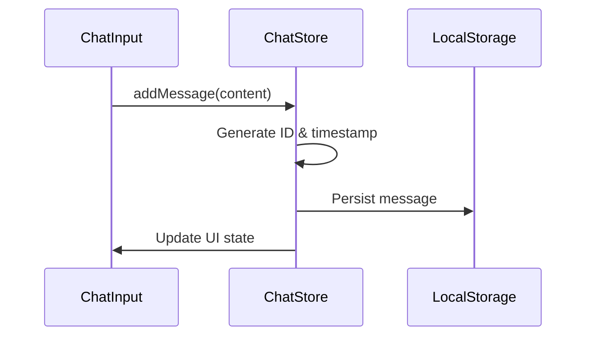
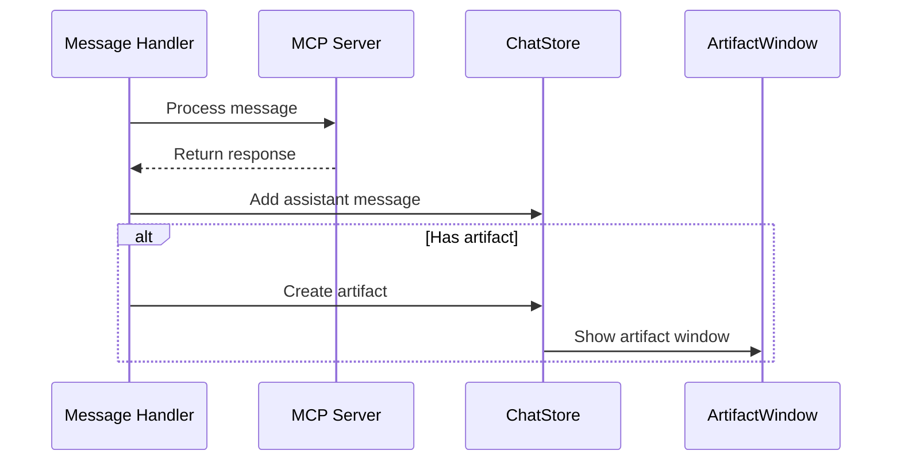
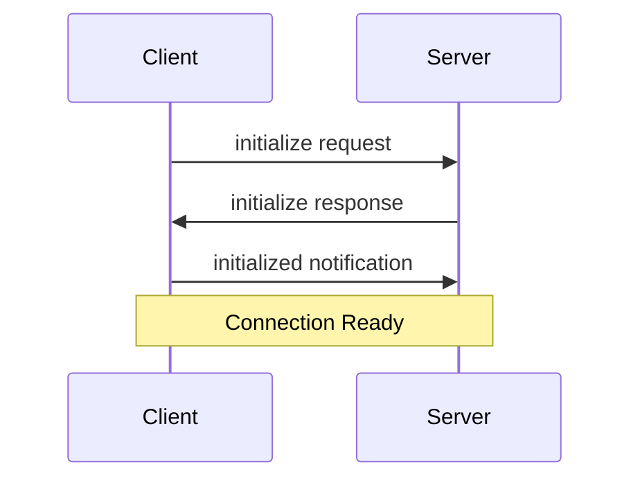
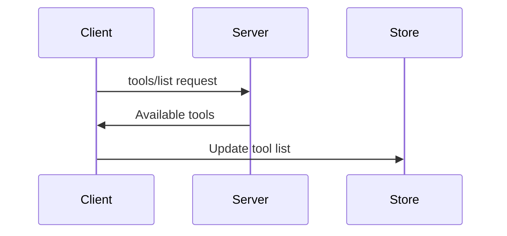
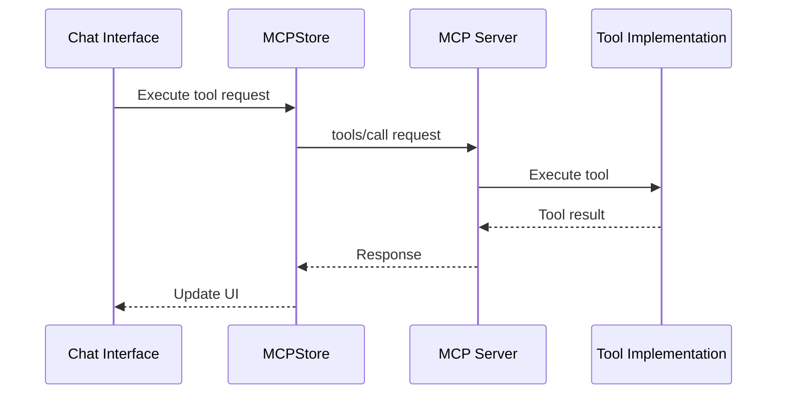
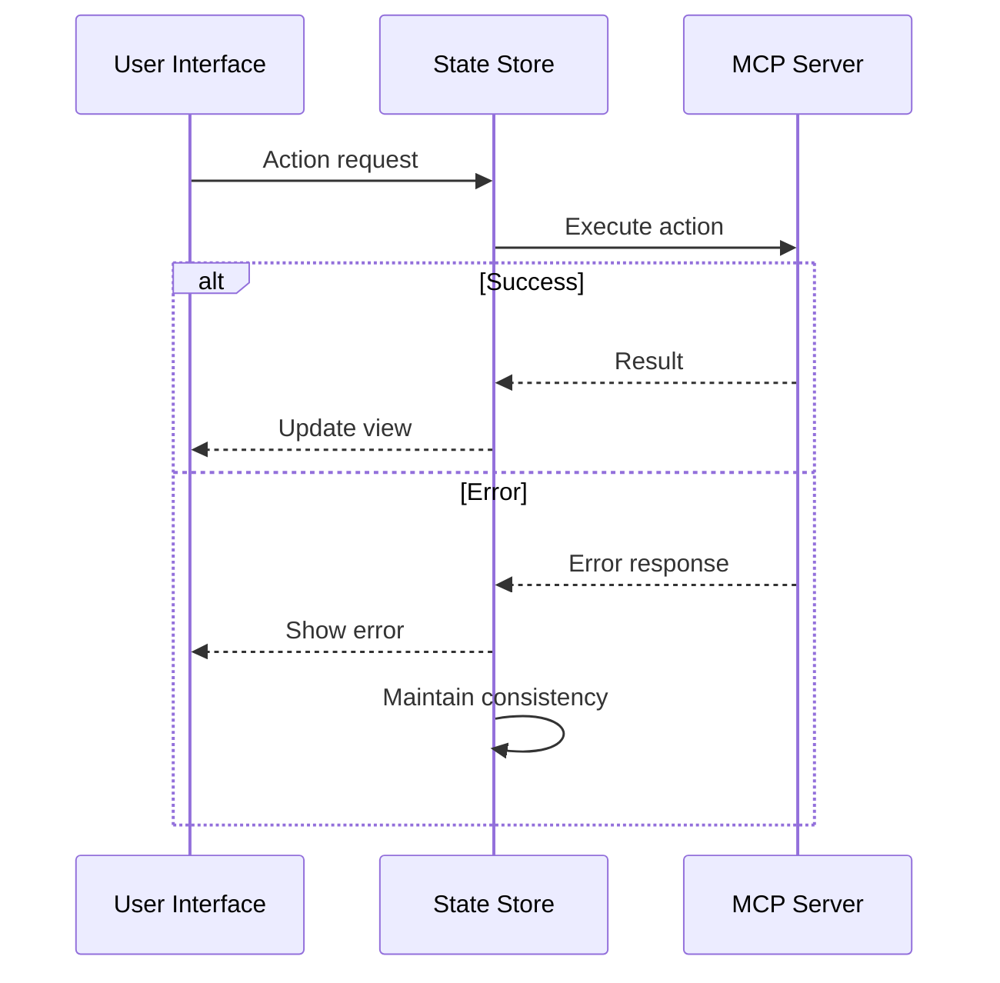

# Data Flow Documentation

This document describes the data flow through the MCP-enabled chat interface, covering message handling, MCP server interactions, artifact creation, and tool execution.

## Table of Contents
- [Core Data Structures](#core-data-structures)
- [Message Flow](#message-flow)
- [Store Interactions](#store-interactions)
- [MCP Server Communication](#mcp-server-communication)
- [Artifact Lifecycle](#artifact-lifecycle)
- [Tool Execution Flow](#tool-execution-flow)
- [State Management](#state-management)
- [Error Handling](#error-handling)

## Core Data Structures

### Message Structure
```typescript
interface Message {
  id: string;         // Unique identifier
  role: 'user' | 'assistant'; // Message sender
  content: string;    // Message text
  timestamp: Date;    // Creation time
  artifactId?: string; // Optional link to artifact
}
```

### Artifact Structure
```typescript
interface Artifact {
  id: string;         // Unique identifier
  type: string;       // Content type (code, svg, etc.)
  title: string;      // Display title
  content: string;    // Actual content
  timestamp: Date;    // Creation time
  messageId: string;  // Link to originating message
  language?: string;  // Optional language for code
}
```

### MCP Tool Structure
```typescript
interface MCPTool {
  name: string;       // Tool identifier
  description: string; // Tool description
  inputSchema: JSONSchemaType<any>; // Expected input format
}
```

## Message Flow

### 1. User Message Creation


### 2. Assistant Response Flow


## Store Interactions

### ChatStore Operations

1. **Message Addition**
```typescript
addMessage: (message) => {
  const newMessage = {
    ...message,
    id: crypto.randomUUID(),
    timestamp: new Date()
  };
  set((state) => ({
    messages: [...state.messages, newMessage]
  }));
}
```

2. **Artifact Creation**
```typescript
addArtifact: (artifact) => {
  const id = crypto.randomUUID();
  set((state) => ({
    artifacts: [...state.artifacts, {
      ...artifact,
      id,
      timestamp: new Date()
    }],
    selectedArtifactId: id,
    showArtifactWindow: true
  }));
  return id;
}
```

### MCPStore Operations

1. **Server Connection**
```typescript
connectServer: async (name, command, args) => {
  const transport = new StdioClientTransport({ command, args });
  const client = new Client({ name: "chat-interface" });
  await client.connect(transport);
  // Fetch capabilities and update state
}
```

2. **Tool Execution**
```typescript
executeTool: async (serverName, toolName, args) => {
  const server = get().servers[serverName];
  const response = await server.client.request({
    method: "tools/call",
    params: { name: toolName, arguments: args }
  });
  return response.content[0].text;
}
```

## MCP Server Communication

### Connection Lifecycle

1. **Initialization**


2. **Tool Discovery**


### Tool Execution Flow

1. **Request Flow**


## Artifact Lifecycle

### 1. Creation
- Triggered by assistant response or tool execution
- Generates unique ID
- Updates store state
- Shows artifact window

### 2. Storage
- Persisted in LocalStorage
- Linked to originating message
- Maintains type information

### 3. Display
- Rendered based on content type
- Supports multiple formats
- Handles updates

### 4. Updates
```typescript
updateArtifact: (id, content) => {
  set((state) => ({
    artifacts: state.artifacts.map((art) =>
      art.id === id ? { ...art, content } : art
    )
  }));
}
```

## Tool Execution Flow

### 1. Pre-execution
- Validate tool availability
- Check input schema
- Prepare arguments

### 2. Execution
- Send request to MCP server
- Wait for response
- Handle timeouts

### 3. Post-execution
- Process response
- Create artifacts if needed
- Update UI state

### 4. Error Handling
- Catch execution errors
- Provide user feedback
- Maintain system state

## State Management

### Local Storage Persistence
```typescript
persist(
  (set, get) => ({
    // Store implementation
  }),
  {
    name: 'chat-storage',
    partialize: (state) => ({
      messages: state.messages,
      artifacts: state.artifacts
    })
  }
)
```

### Real-time Updates
1. Message additions trigger UI updates
2. Artifact changes reflect immediately
3. Tool execution status shown in real-time

## Error Handling

### Types of Errors

1. **Communication Errors**
   - Server connection failures
   - Tool execution timeouts
   - Network issues

2. **State Errors**
   - Invalid message format
   - Artifact creation failures
   - Store update errors

3. **Tool Errors**
   - Invalid input
   - Execution failures
   - Resource access issues

### Error Flow


## Performance Considerations

1. **Message Handling**
   - Batch updates when possible
   - Implement virtualization for long conversations
   - Lazy load artifacts

2. **MCP Communication**
   - Cache tool results when appropriate
   - Implement request debouncing
   - Handle connection retries

3. **State Updates**
   - Use selective updates
   - Implement proper memoization
   - Optimize persistence strategy

This documentation should provide a comprehensive understanding of the data flow in the application. Each section can be expanded based on specific implementation details or requirements.