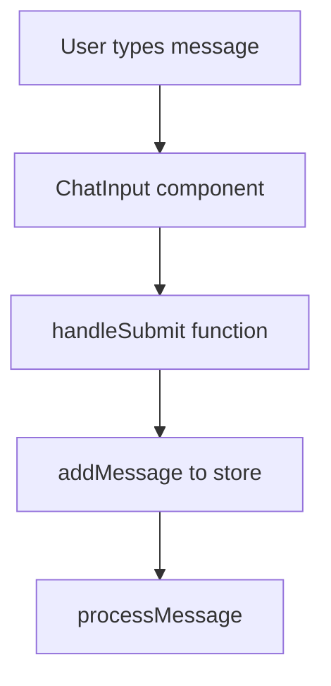
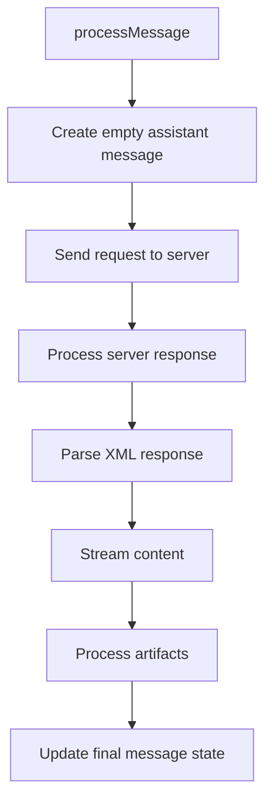
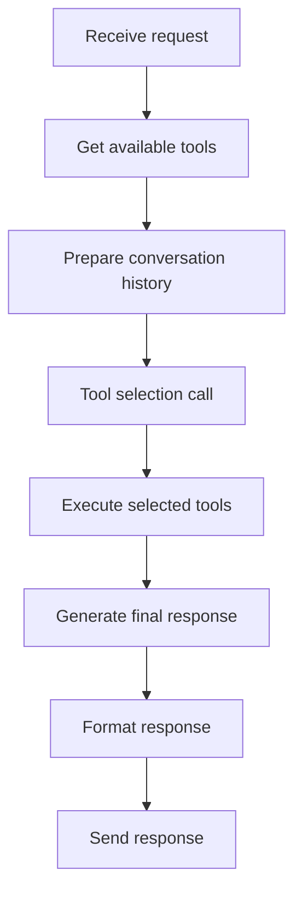
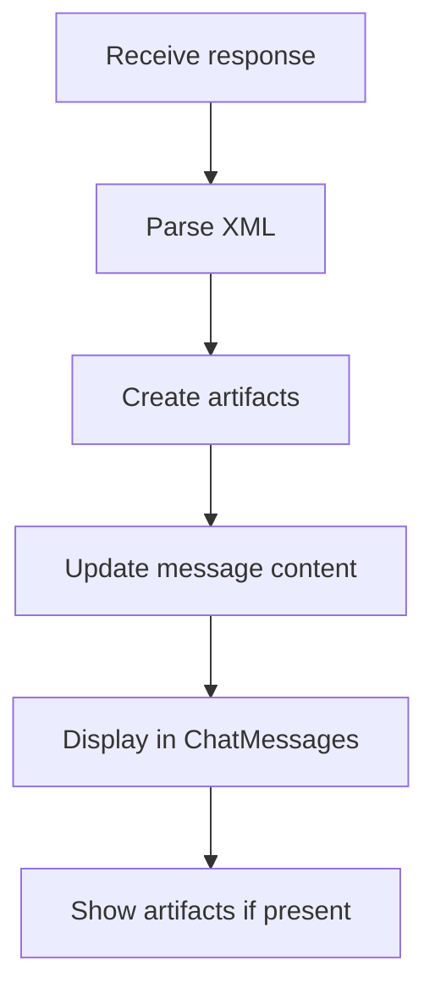

# Chat Process Flow Documentation

## Overview

This document details the complete flow of the chat process in the MCP application, from user input to response display. The process involves multiple components working together to handle messages, manage state, process responses, and display content.

## Components and Files

### Core Components
1. **Chat Interface** (`src/components/chat/ChatInterface.tsx`)
   - Main container component
   - Manages layout and component composition
   - Integrates chat messages, input, and artifact display

2. **Chat Input** (`src/components/chat/ChatInput.tsx`)
   - Handles user input
   - Manages text input state
   - Triggers message processing

3. **Chat Messages** (`src/components/chat/ChatMessages.tsx`)
   - Displays message history
   - Handles message formatting
   - Manages scroll behavior
   - Displays thinking process and streaming content

4. **Assistant Markdown** (`src/components/chat/AssistantMarkdown.tsx`)
   - Renders markdown content
   - Handles code syntax highlighting
   - Manages artifact references

### State Management
- **Chat Store** (`src/store/chatStore.ts`)
  - Central state management
  - Message processing
  - Artifact management
  - Streaming state control

### Server Integration
- **Server Endpoint** (`src/server/index.ts`)
  - API endpoint handling
  - MCP tool integration
  - Response formatting
  - Error handling

### Type Definitions
- **Chat Types** (`src/types/chat.ts`)
  - Message interfaces
  - XML response types
  - Streaming state types

## Data Flow Process

### 1. User Input Phase


#### Implementation Details (`src/components/chat/ChatInput.tsx`):
```typescript
const handleSubmit = async (e: React.FormEvent) => {
    e.preventDefault();
    if (!input.trim()) return;
    
    addMessage({
        role: 'user',
        content: input
    });
    
    await processMessage(input);
    setInput(''); // Reset input
};
```

### 2. Message Processing Phase


#### Implementation Details (`src/store/chatStore.ts`):
```typescript
processMessage: async (content: string) => {
    // Initialize streaming state
    set({ 
        isLoading: true, 
        error: null,
        streamingContent: '',
        streamingComplete: false
    });
    
    // Server communication
    const response = await fetch('/api/chat', {
        method: 'POST',
        headers: { 'Content-Type': 'application/json' },
        body: JSON.stringify({
            message: content,
            history: messages
        })
    });
    
    // Process response and stream content
    const xmlResponse = await parseXMLResponse(data.response);
    // Stream content in chunks
    // Process artifacts
    // Update final message state
}
```

### 3. Server Processing Phase


#### Implementation Details (`src/server/index.ts`):
```typescript
app.post('/api/chat', async (req, res) => {
    const { message, history } = req.body;
    
    // Get tools and prepare history
    const formattedTools = await getAllAvailableTools();
    const messages = [...history, { role: 'user', content: message }];
    
    // Tool selection and execution
    const toolResponse = await processToolSelection(messages, formattedTools);
    
    // Generate and format final response
    const finalResponse = await generateResponse(messages, toolResponse);
    
    res.json({ response: finalResponse });
});
```

### 4. Response Display Phase


#### Implementation Details (`src/components/chat/ChatMessages.tsx`):
```typescript
export const ChatMessages: React.FC<{ messages: MessageWithThinking[] }> = ({ messages }) => {
    return (
        <div className="flex-1 overflow-y-auto">
            {messages.map((message) => (
                // Render message content
                // Show thinking process if present
                // Display artifacts if linked
                // Handle streaming state
            ))}
        </div>
    );
};
```

## State Management

### Message State
- Messages are stored in an array in the chat store
- Each message contains:
  - Content
  - Role (user/assistant)
  - Optional thinking process
  - Optional artifact reference

### Streaming State
- Managed through:
  - `streamingMessageId`
  - `streamingContent`
  - `streamingComplete`
- Updates message content progressively

### Artifact State
- Artifacts are stored separately from messages
- Linked to messages through `artifactId`
- Can be displayed in the artifact window

## Error Handling

### Client-Side Errors
1. Input validation
2. Network request errors
3. Response parsing errors
4. Streaming errors

### Server-Side Errors
1. Tool execution errors
2. Response formatting errors
3. XML validation errors

## Performance Considerations

### Message Rendering
- Uses virtualization for large message lists
- Efficient markdown rendering
- Optimized scroll handling

### State Updates
- Batched updates for streaming content
- Efficient artifact management
- Optimized store updates

## Security Considerations

1. Input sanitization
2. Response validation
3. Error message sanitization
4. Safe markdown rendering

## Best Practices

1. **Message Processing**
   - Always validate input
   - Handle streaming gracefully
   - Provide user feedback

2. **State Management**
   - Keep state updates atomic
   - Handle errors appropriately
   - Maintain clear state structure

3. **UI/UX**
   - Smooth content streaming
   - Clear error messages
   - Responsive interface

## Future Considerations

1. **Performance Optimizations**
   - Message virtualization
   - Lazy loading of artifacts
   - Improved streaming

2. **Feature Additions**
   - Message search
   - Advanced filtering
   - Enhanced artifact handling

3. **Maintenance**
   - Regular state cleanup
   - Error tracking
   - Performance monitoring 