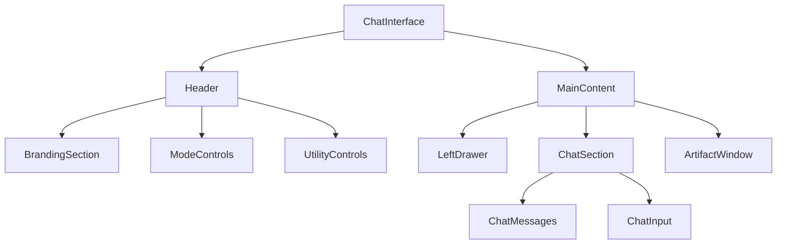

# Chat Layout Documentation

## Overview
The chat interface is a sophisticated layout system that combines multiple components to create a flexible and responsive user experience. The layout adapts to different modes (grant/research) and supports features like file references, artifacts, and project management.

## Core Layout Structure

### Main Container
```tsx
<div className="flex flex-col h-screen bg-gray-200 dark:bg-gray-900">
```
The main container uses a flex column layout and takes up the full viewport height.

### Header Section
The header is a fixed-position element at the top of the screen with the following characteristics:
- Background: `bg-white/90 dark:bg-gray-800/90` with backdrop blur
- Border bottom: `border-gray-200 dark:border-gray-700`
- Contains multiple control sections separated by dividers

#### Header Sections (Left to Right)
1. **Branding & Project**
   - BrainWaveCharmStatic logo
   - Selected project name (when applicable)

2. **Mode Controls**
   - Project List button
   - Research Mode toggle
   - Grant Mode toggle

3. **Model Selection**
   - Model selector dropdown

4. **Utility Controls**
   - File Manager
   - MCP Server Status
   - Display Settings (Dark Mode)
   - Chat Controls (List, Artifact Window, Clear Chat)
   - Streaming Controls

### Main Content Area
```tsx
<div className="flex flex-1 overflow-hidden">
```
The main content area uses a flexible layout that can adapt to different configurations:

#### Left Drawer (Conditional)
- Shows `ProjectDrawer` in grant mode
- Shows `ConversationDrawer` in research mode
- Collapsible for more space

#### Chat Section
```tsx
<div className={`${showArtifactWindow ? 'w-1/2' : 'w-full'} transition-all duration-300`}>
```
- Adapts width based on artifact window visibility
- Smooth transition animations
- Contains:
  - Message history
  - Chat input
  - Status updates

#### Artifact Window (Optional)
```tsx
{showArtifactWindow && <ArtifactWindow storageService={storageService} />}
```
- Takes up 50% width when visible
- Shows generated artifacts and files
- Can be toggled via header controls

### Chat Input Area
- Fixed at bottom of chat section
- Expands vertically with content
- Supports:
  - File references via @ mentions
  - Paste handling
  - Markdown formatting

## Component Hierarchy


## Responsive Behavior

### Width Breakpoints
- Full width: Default chat view
- Split view: When artifact window is open (50/50 split)
- Mobile: Responsive adjustments (TBD)

### Height Management
- Header: Fixed height
- Main content: Flexible growth
- Chat input: Dynamic height with max limit
- Scrollable message area

## Theme Support
The layout supports both light and dark themes through Tailwind classes:
- Light theme colors:
  - Background: `bg-gray-200`
  - Components: `bg-white`
  - Borders: `border-gray-200`

- Dark theme colors:
  - Background: `bg-gray-900`
  - Components: `bg-gray-800`
  - Borders: `border-gray-700`

## Modal Overlays

### File Manager Modal
```tsx
<div className="fixed inset-0 bg-black/50 dark:bg-black/70 flex items-start justify-center pt-16 z-50">
```
- Full screen overlay
- Centered content
- Semi-transparent backdrop
- High z-index for proper stacking

### Project Views
- Project List View: Full screen overlay for project selection
- Project View: Detailed view of selected project
- Both support smooth transitions and proper state management

## File Reference Popup Troubleshooting

When implementing the file reference popup triggered by typing '@', several approaches were tested:

### What Didn't Work
1. **Debounce Timing**: Initially suspected that debounce delay (300ms) was preventing proper rendering, but removing debounce didn't resolve the issue.
2. **Positioning Approaches**: 
   - Using `bottom: '100%'` with absolute positioning
   - Using `top: '-220px'` with absolute positioning

### What Worked
1. **Moving the popup outside of the `<form>` element** while keeping it within the parent container:

```tsx
<div className="w-full max-w-4xl mx-auto px-4 flex relative">
  {/* Popup moved outside form but inside the container */}
  {isActive && position && selectedProjectId ? (
    <div className="absolute z-[9999] bg-white dark:bg-gray-800 ...">
      <div className="text-sm font-medium ...">Reference a file</div>
      <FileReferencePopup ... />
    </div>
  ) : null}
  
  <form onSubmit={handleSubmit} className="relative w-full flex">
    <textarea ... />
  </form>
</div>
```

2. **Final styling improvements**:
   - Fixed position using `bottom: '120px'` instead of negative top values
   - Added padding and a title header
   - Applied proper light/dark theme styling
   - Fixed width (400px) and increased height (300px max)
   - Proper z-index (9999) to ensure visibility

### Why This Worked
HTML forms can have unexpected constraints on positioning and z-index behavior for child elements. By moving the popup outside the form element:
1. The popup is no longer subject to form-specific layout behaviors
2. The parent container's `relative` positioning provides the correct positioning context
3. The popup can properly stack above other content with z-index

This approach required minimal change to the component structure while fixing the visibility issue.

## Best Practices

### State Management
- Use Zustand stores for global state
- Local state for component-specific behavior
- Proper cleanup in useEffect hooks

### Performance
- Debounced input handling
- Conditional rendering of heavy components
- Proper memo usage for expensive computations

### Accessibility
- Proper ARIA labels
- Keyboard navigation support
- Focus management in modals

## Future Enhancements
1. Mobile responsiveness improvements
2. More flexible layout configurations
3. Customizable component positioning
4. Enhanced transition animations
5. Better touch device support 