# Chat Interface Layout Structure

## Component Hierarchy and Layout

```mermaid
graph TD
    A[ChatInterface] --> B[Main Header]
    A --> C[Main Content]
    A --> J[Project List View]
    
    %% Header Section
    B --> D[Left Section]
    B --> E[Right Controls]
    
    D --> D1[BrainWaveCharmStatic]
    
    E --> E1[Mode Buttons]
    E1 --> E1a[Grant Mode]
    E1 --> E1b[Project List]
    E1 --> E1c[Research Mode]
    E --> E2[Model Selection]
    E --> E3[Files Section]
    E --> E4[MCP Server]
    E --> E5[Display Controls]
    E --> E6[Chat Controls]
    E --> E7[Streaming Controls]
    E --> E8[Testing Tools]
    
    %% Main Content Section
    C --> F[Left Drawer]
    C --> G[Chat Section]
    C --> H[Artifact Section]
    
    %% Left Drawer Details
    F --> F1[ProjectDrawer]
    F --> F2[ConversationDrawer]
    
    %% Chat Section Details
    G --> G1[ChatMessages]
    G --> G2[ChatInput]
    
    %% Artifact Section
    H --> H1[ArtifactWindow]
    H --> H2[ArtifactDrawer]

    %% Project List View Details
    J --> J1[Project List]
    J --> J2[Add Project Button]

    %% Modals and Overlays
    A --> I[Modals]
    I --> I1[MCPStatusModal]
    I --> I2[FileManager Modal]

    %% Styling Info
    classDef header fill:#e3f2fd,stroke:#2196f3
    classDef content fill:#f5f5f5,stroke:#9e9e9e
    classDef controls fill:#bbdefb,stroke:#1976d2
    classDef modals fill:#ffebee,stroke:#f44336
    classDef projects fill:#e8f5e9,stroke:#4caf50
    
    class B,D,E header
    class C,F,G,H content
    class E1,E2,E3,E4,E5,E6,E7,E8 controls
    class I,I1,I2 modals
    class J,J1,J2 projects

```

## Layout Description

### Main Header (`bg-white/90 dark:bg-gray-800/90`)
- Fixed at top
- Contains all control buttons and app branding
- Organized into sections with dividers
- New Projects button in Mode section

### Main Content (Flex Layout)
1. **Left Drawer** (Conditional)
   - Shows either ProjectDrawer or ConversationDrawer based on mode
   - Toggle-able visibility

2. **Chat Section** (`w-1/2` or `w-full`)
   - Main chat messages area
   - Chat input at bottom
   - Responsive width based on artifact window visibility

3. **Artifact Section** (Conditional)
   - Shows when `showArtifactWindow` is true
   - Takes up half the width when visible

### Project List View (Full Screen Overlay)
- Appears when project list button is clicked
- Shows list of all projects
- Add new project button
- Overlays main content when active

### Modals and Overlays
- MCPStatusModal
- FileManager Modal
- Testing Tools Dropdown

### Key Features
- Responsive layout using Tailwind CSS
- Dark mode support
- Smooth transitions between states
- Modal overlays for additional functionality 