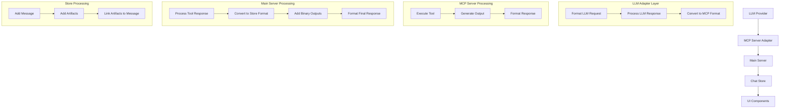

# Chat and Artifact Processing Flow

## Overview
This document serves as a comprehensive blueprint for implementing LLM server components that integrate with the MCP (Model Context Protocol) system. It details the complete flow of chat messages and artifacts, data transformations, and integration requirements for new LLM providers.

## 1. Data Flow Overview



## 2. Integration Requirements

### 2.1 LLM Adapter Interface
```typescript
interface LLMAdapter {
  // Required Methods
  initialize(config: AdapterConfig): Promise<void>;
  processMessage(message: string, history: ChatMessage[]): Promise<LLMResponse>;
  
  // Optional Methods
  validateResponse?(response: unknown): boolean;
  handleError?(error: Error): LLMResponse;
}

interface AdapterConfig {
  apiKey?: string;
  model?: string;
  endpoint?: string;
  maxTokens?: number;
  temperature?: number;
  // Add other LLM-specific configurations
}

interface LLMResponse {
  content: Array<{
    type: "text" | "tool_use";
    text?: string;
    name?: string;
    input?: Record<string, unknown>;
  }>;
  metadata?: {
    usage?: {
      promptTokens?: number;
      completionTokens?: number;
      totalTokens?: number;
    };
    model?: string;
    // Add other LLM-specific metadata
  };
}
```

## 3. Response Format Requirements

### 3.1 Standard Text Response
```typescript
{
  content: [{
    type: "text",
    text: string,
    metadata?: {
      hasBinaryOutput?: boolean,
      binaryType?: string
    }
  }],
  isError: boolean
}
```

### 3.2 Binary Output Response
```typescript
{
  content: [{
    type: "text",
    text: string,
    metadata: {
      hasBinaryOutput: true,
      binaryType: string
    }
  }],
  binaryOutput: {
    type: string,
    data: string,
    metadata: {
      size?: number,
      sourceCode?: string
    }
  },
  isError: boolean
}
```

### 3.3 Tool Response Format
```typescript
interface ToolResponse {
  type: 'tool_use';
  name: string;
  input: {
    thinking?: string;
    conversation: Array<{
      type: 'text' | 'artifact';
      content?: string;
      metadata?: {
        hasBinaryOutput?: boolean;
        binaryType?: string;
        [key: string]: any;
      };
      artifact?: {
        type: string;
        id: string;
        title: string;
        content: string;
        language?: string;
      };
    }>;
  };
  binaryOutput?: {
    type: string;
    data: string;
    metadata: {
      size?: number;
      sourceCode?: string;
      [key: string]: any;
    };
  };
}
```

## 4. Server Processing Steps

### 4.1 Tool Response Processing
Location: `src/server/index.ts`

1. **Initial Tool Execution**
   ```typescript
   const toolResult = await client.callTool({
     name: toolName,
     arguments: content.input
   });
   ```

2. **Binary Output Collection**
   - Binary outputs are collected in `messages.binaryOutputs` array
   - Each binary output includes:
     - Original data
     - Source code (if available)
     - Metadata

### 4.2 Store Format Conversion
Location: `src/server/index.ts` - `convertToStoreFormat` function

1. **Artifact Creation**
   ```typescript
   {
     id: string,
     artifactId: string,
     type: string,
     title: string,
     content: string,
     position: number,
     language?: string
   }
   ```

2. **Type Validation**
   - Uses `validateArtifactType` to normalize artifact types
   - Handles special cases:
     - Code artifacts
     - Binary outputs
     - Markdown content

3. **Button Generation**
   ```html
   <button 
     class="artifact-button text-sm text-blue-600 dark:text-blue-400 hover:underline" 
     data-artifact-id="${id}" 
     data-artifact-type="${type}" 
     style="cursor: pointer; background: none; border: none; padding: 0;">
     📎 ${title}
   </button>
   ```

## 5. Store Processing

### 5.1 Message Storage
Location: `src/store/chatStore.ts`

1. **Message Format**
   ```typescript
   interface MessageWithThinking {
     role: 'user' | 'assistant';
     content: string;
     id: string;
     timestamp: Date;
     thinking?: string;
     artifactId?: string;
   }
   ```

2. **Artifact Storage**
   ```typescript
   interface Artifact {
     id: string;
     artifactId: string;
     type: string;
     title: string;
     content: string;
     position: number;
     language?: string;
   }
   ```

### 5.2 Processing Flow
1. **Message Addition**
   ```typescript
   addMessage: (message) => set((state) => ({
     messages: [...state.messages, {
       ...message,
       id: crypto.randomUUID(),
       timestamp: new Date()
     }]
   }))
   ```

2. **Artifact Addition**
   ```typescript
   addArtifact: (artifact) => {
     set((state) => ({
       artifacts: [...state.artifacts, {
         ...artifact,
         timestamp: new Date()
       }].sort((a, b) => a.position - b.position)
     }));
     return artifact.id;
   }
   ```

## 6. Special Cases

### 6.1 Binary Outputs
1. **Collection**
   - Stored in `messages.binaryOutputs` array
   - Includes both binary data and source code

2. **Processing**
   - Added to artifacts array
   - Buttons generated for both binary output and source code
   - Linked in conversation if not already present

### 6.2 Bibliography
1. **Collection**
   - Stored in `messages.bibliography` array
   - Deduplicated based on PMID

2. **Processing**
   - Added as special artifact type
   - Linked at end of conversation

## 7. UI Integration

### 7.1 Artifact Display
1. **Button Generation**
   - Embedded in conversation text
   - Contains metadata for artifact linking

2. **Artifact Window**
   - Shows selected artifact
   - Maintains artifact state

### 7.2 State Management
1. **Selection**
   ```typescript
   selectArtifact: (id) => set({ 
     selectedArtifactId: id,
     showArtifactWindow: true 
   })
   ```

2. **Visibility**
   ```typescript
   toggleArtifactWindow: () => set((state) => ({
     showArtifactWindow: !state.showArtifactWindow
   }))
   ```

## 8. Data Flow Example

### 8.1 Python Code with PNG Output
```typescript
// 1. MCP Server Response
{
  content: [{
    type: "text",
    text: "Generated PNG output...",
    metadata: { hasBinaryOutput: true }
  }],
  binaryOutput: {
    type: "image/png",
    data: "base64...",
    metadata: { sourceCode: "python..." }
  }
}

// 2. Store Format
{
  thinking: "...",
  conversation: "... <button>...</button>",
  artifacts: [{
    id: "...",
    type: "image/png",
    content: "base64...",
    position: 0
  }, {
    id: "...",
    type: "application/vnd.ant.python",
    content: "python...",
    position: 1
  }]
}
```

## 9. Important Notes

1. **Artifact ID Management**
   - UUIDs used for unique identification
   - Separate IDs for binary output and source code
   - IDs preserved in button attributes

2. **Type Normalization**
   - Consistent type strings used throughout
   - Special handling for Python code artifacts
   - Binary types preserved as-is

3. **Position Management**
   - Artifacts ordered by position
   - New artifacts appended to end
   - Positions used for display order

4. **Button Integration**
   - Generated for all artifacts
   - Added inline for referenced artifacts
   - Added at end for unreferenced artifacts

## 10. Implementation Guide for New LLM Providers

### 10.1 Required Components

1. **Adapter Implementation**
   ```typescript
   class NewLLMAdapter implements LLMAdapter {
     private config: AdapterConfig;
     
     async initialize(config: AdapterConfig) {
       this.config = config;
       // Initialize LLM client/connection
     }
     
     async processMessage(message: string, history: ChatMessage[]) {
       // 1. Convert history to LLM's format
       // 2. Make API call to LLM
       // 3. Convert response to standard format
       // 4. Handle any LLM-specific features
       return convertedResponse;
     }
   }
   ```

2. **Message Format Conversion**
   ```typescript
   interface LLMSpecificFormat {
     // Define LLM's native format
   }
   
   function convertToLLMFormat(messages: ChatMessage[]): LLMSpecificFormat {
     // Convert standard messages to LLM format
   }
   
   function convertFromLLMFormat(response: LLMSpecificFormat): LLMResponse {
     // Convert LLM response to standard format
   }
   ```

### 10.2 Integration Checklist

1. **Message Processing**
   - [ ] Implement history conversion
   - [ ] Handle streaming if supported
   - [ ] Implement token counting
   - [ ] Handle rate limiting

2. **Response Handling**
   - [ ] Convert response format
   - [ ] Handle errors gracefully
   - [ ] Process binary outputs
   - [ ] Handle metadata

3. **Tool Integration**
   - [ ] Implement tool calling format
   - [ ] Handle tool responses
   - [ ] Process binary outputs
   - [ ] Manage tool state

4. **Error Handling**
   - [ ] API errors
   - [ ] Rate limits
   - [ ] Token limits
   - [ ] Network issues

### 10.3 Configuration Requirements

```typescript
interface LLMConfig {
  // Required
  provider: string;
  model: string;
  apiKey: string;
  
  // Optional
  endpoint?: string;
  maxTokens?: number;
  temperature?: number;
  timeout?: number;
  retries?: number;
  
  // Rate Limiting
  maxRequestsPerMinute?: number;
  maxTokensPerMinute?: number;
  
  // Streaming
  supportsStreaming?: boolean;
  streamChunkSize?: number;
  
  // Tools
  supportedTools?: string[];
  maxToolCalls?: number;
}
```

### 10.4 Testing Requirements

1. **Basic Functionality**
   - Message processing
   - History handling
   - Response formatting

2. **Tool Integration**
   - Tool calling
   - Tool response processing
   - Binary output handling

3. **Error Scenarios**
   - API errors
   - Rate limiting
   - Token limits
   - Network issues

4. **Performance**
   - Response time
   - Memory usage
   - Token usage

## 11. Validation and Testing

### 11.1 Response Validation
```typescript
function validateLLMResponse(response: unknown): boolean {
  // 1. Check response structure
  // 2. Validate content format
  // 3. Check required fields
  // 4. Validate metadata
  return isValid;
}
```

### 11.2 Integration Tests
```typescript
async function testLLMIntegration(adapter: LLMAdapter) {
  // 1. Test basic message processing
  // 2. Test history handling
  // 3. Test tool integration
  // 4. Test error handling
  // 5. Test binary output processing
}
```

## 12. Common Integration Pitfalls

1. **Format Mismatches**
   - Inconsistent message formats
   - Missing required fields
   - Incorrect type conversions

2. **State Management**
   - Tool state not preserved
   - History format issues
   - Metadata loss

3. **Error Handling**
   - Incomplete error coverage
   - Missing fallbacks
   - Incorrect error formats

4. **Performance**
   - Token counting issues
   - Rate limit violations
   - Memory leaks

## 13. Security Considerations

1. **API Key Management**
   - Secure storage
   - Key rotation
   - Access control

2. **Data Processing**
   - Input sanitization
   - Output validation
   - Content filtering

3. **Rate Limiting**
   - Request throttling
   - Token usage monitoring
   - Cost control 