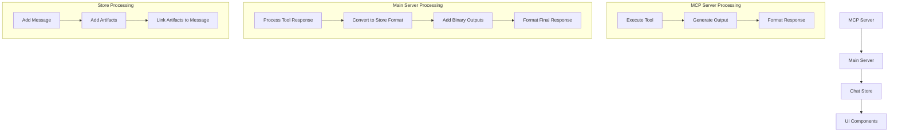

# Chat and Artifact Processing Flow

## Overview
This document details the complete flow of chat messages and artifacts from the MCP server through the main server to the client store. It covers data transformations, formatting, and the handling of various artifact types.

## 1. Data Flow Overview



## 2. MCP Server Response Format

### 2.1 Standard Text Response
```typescript
{
  content: [{
    type: "text",
    text: string,
    metadata?: {
      hasBinaryOutput?: boolean,
      binaryType?: string
    }
  }],
  isError: boolean
}
```

### 2.2 Binary Output Response
```typescript
{
  content: [{
    type: "text",
    text: string,
    metadata: {
      hasBinaryOutput: true,
      binaryType: string
    }
  }],
  binaryOutput: {
    type: string,
    data: string,
    metadata: {
      size?: number,
      sourceCode?: string
    }
  },
  isError: boolean
}
```

## 3. Server Processing Steps

### 3.1 Tool Response Processing
Location: `src/server/index.ts`

1. **Initial Tool Execution**
   ```typescript
   const toolResult = await client.callTool({
     name: toolName,
     arguments: content.input
   });
   ```

2. **Binary Output Collection**
   - Binary outputs are collected in `messages.binaryOutputs` array
   - Each binary output includes:
     - Original data
     - Source code (if available)
     - Metadata

### 3.2 Store Format Conversion
Location: `src/server/index.ts` - `convertToStoreFormat` function

1. **Artifact Creation**
   ```typescript
   {
     id: string,
     artifactId: string,
     type: string,
     title: string,
     content: string,
     position: number,
     language?: string
   }
   ```

2. **Type Validation**
   - Uses `validateArtifactType` to normalize artifact types
   - Handles special cases:
     - Code artifacts
     - Binary outputs
     - Markdown content

3. **Button Generation**
   ```html
   <button 
     class="artifact-button text-sm text-blue-600 dark:text-blue-400 hover:underline" 
     data-artifact-id="${id}" 
     data-artifact-type="${type}" 
     style="cursor: pointer; background: none; border: none; padding: 0;">
     📎 ${title}
   </button>
   ```

## 4. Store Processing

### 4.1 Message Storage
Location: `src/store/chatStore.ts`

1. **Message Format**
   ```typescript
   interface MessageWithThinking {
     role: 'user' | 'assistant';
     content: string;
     id: string;
     timestamp: Date;
     thinking?: string;
     artifactId?: string;
   }
   ```

2. **Artifact Storage**
   ```typescript
   interface Artifact {
     id: string;
     artifactId: string;
     type: string;
     title: string;
     content: string;
     position: number;
     language?: string;
   }
   ```

### 4.2 Processing Flow
1. **Message Addition**
   ```typescript
   addMessage: (message) => set((state) => ({
     messages: [...state.messages, {
       ...message,
       id: crypto.randomUUID(),
       timestamp: new Date()
     }]
   }))
   ```

2. **Artifact Addition**
   ```typescript
   addArtifact: (artifact) => {
     set((state) => ({
       artifacts: [...state.artifacts, {
         ...artifact,
         timestamp: new Date()
       }].sort((a, b) => a.position - b.position)
     }));
     return artifact.id;
   }
   ```

## 5. Special Cases

### 5.1 Binary Outputs
1. **Collection**
   - Stored in `messages.binaryOutputs` array
   - Includes both binary data and source code

2. **Processing**
   - Added to artifacts array
   - Buttons generated for both binary output and source code
   - Linked in conversation if not already present

### 5.2 Bibliography
1. **Collection**
   - Stored in `messages.bibliography` array
   - Deduplicated based on PMID

2. **Processing**
   - Added as special artifact type
   - Linked at end of conversation

## 6. UI Integration

### 6.1 Artifact Display
1. **Button Generation**
   - Embedded in conversation text
   - Contains metadata for artifact linking

2. **Artifact Window**
   - Shows selected artifact
   - Maintains artifact state

### 6.2 State Management
1. **Selection**
   ```typescript
   selectArtifact: (id) => set({ 
     selectedArtifactId: id,
     showArtifactWindow: true 
   })
   ```

2. **Visibility**
   ```typescript
   toggleArtifactWindow: () => set((state) => ({
     showArtifactWindow: !state.showArtifactWindow
   }))
   ```

## 7. Data Flow Example

### 7.1 Python Code with PNG Output
```typescript
// 1. MCP Server Response
{
  content: [{
    type: "text",
    text: "Generated PNG output...",
    metadata: { hasBinaryOutput: true }
  }],
  binaryOutput: {
    type: "image/png",
    data: "base64...",
    metadata: { sourceCode: "python..." }
  }
}

// 2. Store Format
{
  thinking: "...",
  conversation: "... <button>...</button>",
  artifacts: [{
    id: "...",
    type: "image/png",
    content: "base64...",
    position: 0
  }, {
    id: "...",
    type: "application/vnd.ant.python",
    content: "python...",
    position: 1
  }]
}
```

## 8. Important Notes

1. **Artifact ID Management**
   - UUIDs used for unique identification
   - Separate IDs for binary output and source code
   - IDs preserved in button attributes

2. **Type Normalization**
   - Consistent type strings used throughout
   - Special handling for Python code artifacts
   - Binary types preserved as-is

3. **Position Management**
   - Artifacts ordered by position
   - New artifacts appended to end
   - Positions used for display order

4. **Button Integration**
   - Generated for all artifacts
   - Added inline for referenced artifacts
   - Added at end for unreferenced artifacts

## 9. Common Issues and Solutions

1. **Missing Artifacts**
   - Check artifact array in store
   - Verify button generation
   - Ensure proper ID linking

2. **Type Mismatches**
   - Use `validateArtifactType`
   - Check type normalization
   - Verify UI handling

3. **Button Placement**
   - Check conversation text
   - Verify button generation
   - Check additional outputs section 