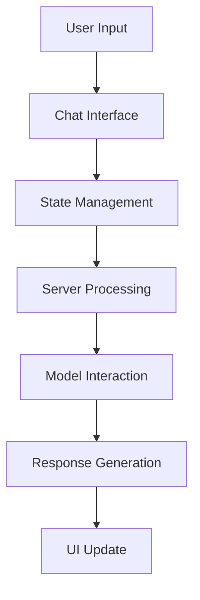

# CHARM MCP (Model Control Protocol) Project Overview

## Introduction

The CHARM MCP project is an advanced chat interface system that integrates with multiple AI model servers through a standardized Model Control Protocol (MCP). It provides a sophisticated chat experience with real-time streaming, artifact generation, and tool execution capabilities.

## Core Features

### 1. Interactive Chat Interface
- Modern, responsive UI with dark mode support
- Real-time message streaming
- Support for markdown formatting
- Code syntax highlighting
- Artifact generation and display
- Thinking process visibility

### 2. AI Model Integration
- Standardized communication with AI models
- Support for multiple model servers
- Dynamic tool discovery and execution
- Structured response handling

### 3. Artifact Management
- Support for multiple artifact types:
  - Markdown documents
  - Code snippets
  - SVG diagrams
  - Mermaid diagrams
  - HTML content
  - React components
  - Bibliography references
- Artifact window for detailed viewing
- Artifact list for easy navigation

### 4. Advanced State Management
- Persistent chat history
- Streaming state control
- Error handling and recovery
- Artifact state management

## System Architecture

### Frontend Components
1. **Chat Interface** (`src/components/chat/`)
   - Main chat window
   - Message input
   - Message display
   - Artifact viewing

2. **State Management** (`src/store/`)
   - Chat state
   - Artifact management
   - MCP server connections

3. **Type System** (`src/types/`)
   - Message types
   - Artifact types
   - Response formats

### Backend Components
1. **Server** (`src/server/`)
   - API endpoints
   - MCP tool management
   - Response formatting

2. **MCP Integration**
   - Tool discovery
   - Tool execution
   - Response processing

## Data Flow Overview

### 1. User Interaction Flow

### 2. Message Processing Flow
1. **Input Phase**
   - User enters message
   - Message added to chat store
   - Server request initiated

2. **Processing Phase**
   - Server receives message
   - Tools are discovered
   - Model processes request
   - Tools are executed
   - Response is generated

3. **Response Phase**
   - XML response created
   - Content is streamed
   - Artifacts are generated
   - UI is updated

4. **Display Phase**
   - Message rendered
   - Thinking process shown
   - Artifacts displayed
   - References linked

### 3. Artifact Flow
1. **Generation**
   - Created during response processing
   - Assigned unique IDs
   - Linked to messages

2. **Storage**
   - Maintained in artifact store
   - Persisted across sessions
   - Efficiently retrieved

3. **Display**
   - Shown in artifact window
   - Referenced in messages
   - Available in artifact list

## Communication Protocol

### 1. Client-Server Communication
- RESTful API endpoints
- JSON request/response format
- Structured error handling
- Streaming support

### 2. Model Communication
- Standardized MCP format
- Tool discovery and execution
- Response formatting
- Error propagation

### 3. Response Format
- XML-based structure
- Thinking process section
- Conversation content
- Artifact definitions

## Security and Performance

### Security Measures
1. Input validation
2. Response sanitization
3. Safe markdown rendering
4. Error message handling

### Performance Optimizations
1. Message streaming
2. Efficient state updates
3. Optimized rendering
4. Resource management

## User Experience

### 1. Interface Design
- Clean, modern layout
- Responsive design
- Dark mode support
- Intuitive navigation

### 2. Interaction Features
- Real-time updates
- Smooth animations
- Clear feedback
- Error notifications

### 3. Content Display
- Formatted messages
- Syntax highlighting
- Interactive artifacts
- Thinking process visibility

## Development Workflow

### 1. Project Structure
- Component-based architecture
- Type-safe development
- Modular design
- Clear separation of concerns

### 2. State Management
- Centralized stores
- Predictable updates
- Persistent storage
- Error recovery

### 3. Testing Strategy
- Component testing
- Integration testing
- Error handling
- Performance monitoring

## Future Roadmap

### 1. Enhanced Features
- Advanced search capabilities
- Improved artifact handling
- Extended tool support
- Enhanced streaming

### 2. Performance Improvements
- Message virtualization
- Lazy loading
- Caching strategies
- Optimized rendering

### 3. User Experience
- Additional themes
- Customization options
- Accessibility improvements
- Mobile optimization

## Conclusion

The CHARM MCP project provides a robust, extensible chat interface system with sophisticated AI model integration capabilities. Its modular architecture, standardized communication protocols, and advanced features make it a powerful platform for AI-powered chat applications. 