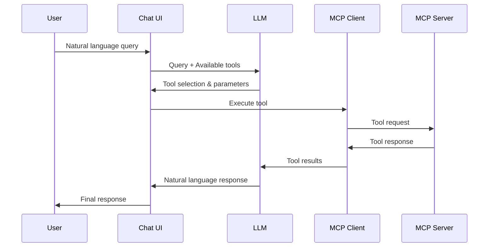

# MCP Natural Language Integration Summary

## Overview

This document outlines how to integrate MCP capabilities with natural language processing in the chat interface, allowing tools to be automatically triggered based on user queries.

## Data Flow

1. **User Input** → **LLM Analysis** → **MCP Tool Selection** → **Tool Execution** → **Response Generation**



## Required Components

### 1. Tool Registration with LLM

Tools must be registered with the LLM to enable automatic detection. Example:

```typescript
// Tool definition that LLM can understand
const tools = [
  {
    name: "get-weather",
    description: "Get current weather for a location",
    parameters: {
      type: "object",
      properties: {
        location: {
          type: "string",
          description: "City name or coordinates"
        }
      },
      required: ["location"]
    }
  }
];

// Register with LLM during chat initialization
const messages = [{
  role: "system",
  content: "You have access to these tools: " + JSON.stringify(tools)
}];
```

### 2. Natural Language Processing Functions

Functions to handle the LLM's tool selection and parameter extraction:

```typescript
interface ToolCall {
  name: string;
  parameters: Record<string, any>;
}

async function processNaturalLanguage(
  query: string,
  availableTools: Tool[]
): Promise<ToolCall | null> {
  // Ask LLM to analyze query and select appropriate tool
  const response = await llm.analyze({
    messages: [
      {
        role: "system",
        content: `Available tools: ${JSON.stringify(availableTools)}`
      },
      {
        role: "user",
        content: query
      }
    ]
  });
  
  // Extract tool call from LLM response
  return parseLLMResponse(response);
}
```

### 3. MCP Integration Functions

Functions to execute MCP tools based on LLM decisions:

```typescript
async function executeMCPTool(toolCall: ToolCall): Promise<string> {
  try {
    // Execute tool through MCP client
    const result = await mcpClient.executeTool(
      toolCall.name,
      toolCall.parameters
    );
    
    // Format result for LLM
    return formatToolResult(result);
  } catch (error) {
    return `Error executing tool: ${error.message}`;
  }
}
```

### 4. Response Generation

Functions to generate final responses using tool results:

```typescript
async function generateResponse(
  query: string,
  toolResult: string
): Promise<string> {
  // Ask LLM to generate response using tool results
  const response = await llm.complete({
    messages: [
      {
        role: "user",
        content: query
      },
      {
        role: "assistant",
        content: `Tool result: ${toolResult}`
      }
    ]
  });
  
  return response.content;
}
```

## Example Flows

### Example 1: Weather Query

User Query: "What's the weather like in Paris?"

1. **LLM Analysis**:
```json
{
  "tool_selection": {
    "name": "get-weather",
    "parameters": {
      "location": "Paris"
    }
  }
}
```

2. **MCP Tool Execution**:
```json
{
  "temperature": 22,
  "conditions": "Partly cloudy",
  "humidity": 65
}
```

3. **Final Response**:
"In Paris, it's currently 22°C and partly cloudy with 65% humidity."

### Example 2: File Search

User Query: "Find all Python files in my project"

1. **LLM Analysis**:
```json
{
  "tool_selection": {
    "name": "search-files",
    "parameters": {
      "pattern": "*.py",
      "directory": "./project"
    }
  }
}
```

2. **MCP Tool Execution**:
```json
{
  "files": [
    "main.py",
    "utils/helpers.py",
    "tests/test_main.py"
  ]
}
```

3. **Final Response**:
"I found 3 Python files in your project: main.py in the root directory, helpers.py in the utils folder, and test_main.py in the tests folder."

## Integration Points

### 1. Chat Component

Update the chat component to include MCP tool registration:

```typescript
class Chat {
  constructor() {
    this.llm = new LLMClient();
    this.mcpClient = new MCPClient();
    this.tools = [];
  }

  async initialize() {
    // Get available tools from MCP
    this.tools = await this.mcpClient.listTools();
    
    // Register tools with LLM
    await this.llm.registerTools(this.tools);
  }

  async processMessage(message: string): Promise<string> {
    // Process through natural language pipeline
    const toolCall = await processNaturalLanguage(message, this.tools);
    
    if (toolCall) {
      const result = await executeMCPTool(toolCall);
      return await generateResponse(message, result);
    }
    
    // Regular chat response if no tool needed
    return await this.llm.complete(message);
  }
}
```

### 2. MCP Client

Extend MCP client to handle tool execution:

```typescript
class MCPClient {
  async listTools(): Promise<Tool[]> {
    // Get tools from all connected servers
    const servers = await this.getServers();
    return servers.flatMap(server => server.tools);
  }

  async executeTool(name: string, parameters: any): Promise<any> {
    // Find server with matching tool
    const server = await this.findServerWithTool(name);
    if (!server) {
      throw new Error(`No server found with tool: ${name}`);
    }
    
    // Execute tool
    return await server.executeTool(name, parameters);
  }
}
```

## Best Practices

1. **Tool Description Quality**
   - Provide clear, detailed descriptions of tools
   - Include example usage in descriptions
   - Specify parameter constraints clearly

2. **Error Handling**
   - Handle tool execution failures gracefully
   - Provide meaningful error messages
   - Allow for fallback responses

3. **Performance**
   - Cache tool listings when possible
   - Implement timeouts for tool execution
   - Monitor tool usage patterns

4. **Security**
   - Validate tool parameters before execution
   - Implement rate limiting
   - Log tool usage for auditing

## Next Steps

1. Implement the natural language processing pipeline
2. Add tool registration to chat initialization
3. Update the chat UI to handle tool execution
4. Add error handling and fallbacks
5. Test with various query patterns 