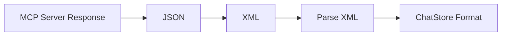
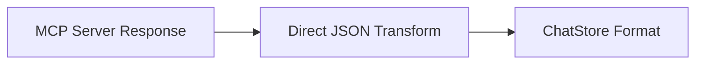

# Plan: Skip XML Transformation in MCP Response Processing

## Implementation Order and Dependencies

### Phase 1: Core Types and Validation (Foundation)
1. Create/update type definition files
   - `src/types/artifacts.ts` - Core type definitions
   ```typescript
   interface Artifact {
     id: string;
     artifactId: string;
     type: string;
     title: string;
     content: string;
     position: number;
     language?: string;
     sourceCode?: string;  // For binary outputs with source code
     buttonProps?: {
       className?: string;
       icon?: string;
     };
     timestamp: Date;
   }
   ```
   - `src/types/mcp.ts` - MCP specific types
   ```typescript
   interface MCPResponse {
     content: Array<{
       type: string;
       text: string;
       metadata?: {
         hasBinaryOutput?: boolean;
         binaryType?: string;
         [key: string]: any;
       }
     }>;
     binaryOutput?: {
       type: string;
       data: string;
       metadata: {
         size: number;
         sourceCode: string;
         [key: string]: any;
       }
     };
     isError: boolean;
   }
   ```

2. Create type validation utilities
   - `src/utils/typeValidation.ts`
   Dependencies: Type definitions

### Phase 2: MCP Response Transformer
1. Create transformer utility
   - `src/utils/mcpTransformer.ts`
   ```typescript
   export function transformMCPResponse(mcpResponse: MCPResponse): FormatterInput {
     const response: FormatterInput = {
       conversation: []
     };

     // Handle binary output case (like PNG with source code)
     if (mcpResponse.binaryOutput) {
       const artifactId = crypto.randomUUID();
       
       // Add the text description
       response.conversation.push({
         type: 'text',
         content: mcpResponse.content[0].text
       });

       // Add the binary output as an artifact with its source code
       response.conversation.push({
         type: 'artifact',
         artifact: {
           id: artifactId,
           type: mcpResponse.binaryOutput.type,
           title: `Generated ${mcpResponse.binaryOutput.type.split('/')[1].toUpperCase()}`,
           content: mcpResponse.binaryOutput.data,
           sourceCode: mcpResponse.binaryOutput.metadata.sourceCode,
           language: 'python',
           position: response.conversation.length,
           buttonProps: {
             className: 'artifact-button',
             icon: '📎'
           }
         }
       });
     } else {
       // Handle regular text/code output
       response.conversation.push({
         type: 'text',
         content: mcpResponse.content[0].text
       });
     }

     return response;
   }
   ```

2. Create transformer tests
   - `src/utils/mcpTransformer.test.ts`
   Dependencies: Transformer implementation

### Phase 3: Store Updates
1. Update ChatStore
   - `src/store/chatStore.ts`
   ```typescript
   addArtifact: (artifact) => {
     console.log(`ChatStore: Adding artifact ${artifact.id} at position ${artifact.position}`);
     set((state) => ({
       artifacts: [...state.artifacts, {
         ...artifact,
         timestamp: new Date(),
         sourceCode: artifact.sourceCode,
         buttonProps: artifact.buttonProps || {
           className: 'artifact-button',
           icon: '📎'
         }
       }].sort((a, b) => a.position - b.position),
       selectedArtifactId: artifact.id,
       showArtifactWindow: true,
     }));
     return artifact.id;
   }
   ```

2. Update artifact handling
   - `src/components/artifacts/*`
   Dependencies: ChatStore updates, Type definitions

### Phase 4: Button Component Implementation
1. Create ArtifactButton Component
   ```typescript
   const ArtifactButton: React.FC<{
     id: string;
     type: string;
     title: string;
     buttonProps?: {
       className?: string;
       icon?: string;
     }
   }> = ({ id, type, title, buttonProps }) => {
     const { selectArtifact } = useChatStore();

     const handleClick = () => {
       console.log('ArtifactButton: clicked with id:', id);
       selectArtifact(id);
     };

     return (
       <button
         className={`inline-flex items-center gap-3 px-3 py-2 
                   bg-slate-200 hover:bg-slate-300
                   text-slate-700
                   rounded-lg border border-slate-300
                   shadow-[0_2px_4px_rgba(148,163,184,0.1)] 
                   hover:shadow-[0_4px_6px_rgba(148,163,184,0.15)]
                   transition-all duration-200
                   min-w-[50%] max-w-full
                   ${buttonProps?.className || ''}`}
         onClick={handleClick}
         data-artifact-id={id}
         data-artifact-type={type}
       >
         <div className="flex-shrink-0 p-2 border-r border-slate-300">
           {getIcon(type)}
         </div>
         <div className="flex flex-col items-start min-w-0">
           <span className="text-sm font-medium truncate w-full">
             {buttonProps?.icon || ''} {title}
           </span>
           <span className="text-xs text-slate-500">Click to open</span>
         </div>
       </button>
     );
   };
   ```

2. Update AssistantMarkdown Component
   ```typescript
   export const AssistantMarkdown: React.FC<AssistantMarkdownProps> = ({ content }) => {
     return (
       <ReactMarkdown 
         children={content}
         remarkPlugins={[remarkGfm]}
         rehypePlugins={[rehypeRaw as any]}
         components={{
           ...markdownComponents,
           button: ({node, ...props}: any) => {
             if (props.className?.includes('artifact-button')) {
               const id = props['data-artifact-id'];
               const type = props['data-artifact-type'];
               const title = props.children[0]?.toString().replace('📎 ', '');
               
               if (id && type && title) {
                 return (
                   <ArtifactButton
                     id={id}
                     type={type}
                     title={title}
                     buttonProps={{
                       className: props.className,
                       icon: '📎'
                     }}
                   />
                 );
               }
             }
             return <button {...props}>{props.children}</button>;
           }
         }}
       />
     );
   };
   ```

### Phase 5: Server Updates
1. Remove XML transformation code
   - `src/server/index.ts`
   Dependencies: All previous phases complete

2. Implement new response processing
   - `src/server/index.ts`
   Dependencies: Transformer, Type validation

### Phase 6: Testing and Validation
1. Unit tests for all new components
2. Integration tests for full flow
3. Performance testing
4. Error handling validation

### Phase 7: UI Polish and Documentation
1. Update source code display
2. Add icons and indicators
3. Update documentation
4. Add logging

## Overview
This plan details the changes needed to remove XML transformation from the MCP response processing pipeline and implement direct JSON transformation. The goal is to maintain a more efficient data flow while preserving the relationship between generated content (like images) and their source code.

## Type System

### Core Types to Match

1. **MCP Server Response Types**:
```typescript
interface MCPResponse {
  content: Array<{
    type: string;
    text: string;
    metadata?: {
      hasBinaryOutput?: boolean;
      binaryType?: string;
      [key: string]: any;
    }
  }>;
  binaryOutput?: {
    type: string;    // e.g., 'image/png'
    data: string;    // base64 encoded data
    metadata: {
      size: number;
      sourceCode: string;  // Python source code
      [key: string]: any;
    }
  };
  isError: boolean;
}
```

2. **FormatterInput (Intermediate Format)**:
```typescript
interface FormatterInput {
  thinking?: string;
  error?: string;
  conversation: Array<{
    type: 'text' | 'artifact';
    content?: string;
    artifact?: {
      type: string;      // Must match MCP types
      id: string;
      title: string;
      content: string;
      language?: string;
      sourceCode?: string;  // From MCP binaryOutput.metadata.sourceCode
      position: number;
    }
  }>;
}
```

3. **ChatStore Types**:
```typescript
interface MessageWithThinking {
  role: 'user' | 'assistant';
  content: string;
  id: string;
  timestamp: Date;
  thinking?: string;
  artifactId?: string;  // Links to Artifact
}

interface Artifact {
  id: string;
  artifactId: string;
  type: string;         // Must match MCP types
  title: string;
  content: string;
  position: number;
  language?: string;
  sourceCode?: string;  // From MCP binaryOutput.metadata.sourceCode
  timestamp: Date;
}
```

### Known Type Constants

```typescript
const ArtifactTypes = {
  // Binary types from MCP
  IMAGE_PNG: 'image/png',
  IMAGE_SVG: 'image/svg+xml',
  
  // Code types
  CODE_PYTHON: 'application/vnd.ant.code',
  CODE_TYPESCRIPT: 'application/vnd.ant.code',
  
  // Other types
  MARKDOWN: 'text/markdown',
  BIBLIOGRAPHY: 'application/vnd.bibliography',
  MERMAID: 'application/vnd.mermaid',
  HTML: 'text/html',
  REACT: 'application/vnd.react'
} as const;

const LanguageTypes = {
  PYTHON: 'python',
  TYPESCRIPT: 'typescript',
  JAVASCRIPT: 'javascript',
  MARKDOWN: 'markdown',
  HTML: 'html'
} as const;
```

## Current Data Flow


## Proposed Data Flow


## Required Interface Changes

### 1. FormatterInput Interface (index.ts)
```typescript
interface FormatterInput {
  thinking?: string;
  error?: string;
  conversation: Array<{
    type: 'text' | 'artifact';
    content?: string;
    artifact?: {
      type: string;
      id: string;
      title: string;
      content: string;
      language?: string;
      sourceCode?: string;  // New field for source code
      position: number;
    }
  }>;
}
```

### 2. Artifact Interface (chatStore.ts)
```typescript
interface Artifact {
  id: string;
  artifactId: string;
  type: string;
  title: string;
  content: string;
  position: number;
  language?: string;
  sourceCode?: string;  // New field for source code
  timestamp: Date;
}
```

## Implementation Steps

### 1. Create MCP Response Transformer
Location: `src/utils/mcpTransformer.ts`

```typescript
interface MCPResponse {
  content: Array<{
    type: string;
    text: string;
    metadata?: {
      hasBinaryOutput?: boolean;
      binaryType?: string;
      [key: string]: any;
    }
  }>;
  binaryOutput?: {
    type: string;
    data: string;
    metadata: {
      size: number;
      sourceCode: string;
      [key: string]: any;
    }
  };
  isError: boolean;
}

export function transformMCPResponse(mcpResponse: MCPResponse): FormatterInput {
  const response: FormatterInput = {
    conversation: []
  };

  // Handle binary output case (like PNG with source code)
  if (mcpResponse.binaryOutput) {
    const artifactId = crypto.randomUUID();
    
    // Add the text description
    response.conversation.push({
      type: 'text',
      content: mcpResponse.content[0].text
    });

    // Add the binary output as an artifact with its source code
    response.conversation.push({
      type: 'artifact',
      artifact: {
        id: artifactId,
        type: mcpResponse.binaryOutput.type,
        title: `Generated ${mcpResponse.binaryOutput.type.split('/')[1].toUpperCase()}`,
        content: mcpResponse.binaryOutput.data,
        sourceCode: mcpResponse.binaryOutput.metadata.sourceCode,
        language: 'python',
        position: response.conversation.length,
        buttonProps: {
          className: 'artifact-button',
          icon: '📎'
        }
      }
    });
  } else {
    // Handle regular text/code output
    response.conversation.push({
      type: 'text',
      content: mcpResponse.content[0].text
    });
  }

  return response;
}
```

### 2. Update ChatStore
Location: `src/store/chatStore.ts`

```typescript
// Add sourceCode support to addArtifact
addArtifact: (artifact) => {
  console.log(`ChatStore: Adding artifact ${artifact.id} at position ${artifact.position}`);
  set((state) => ({
    artifacts: [...state.artifacts, {
      ...artifact,
      timestamp: new Date(),
      sourceCode: artifact.sourceCode,
      buttonProps: artifact.buttonProps || {
        className: 'artifact-button',
        icon: '📎'
      }
    }].sort((a, b) => a.position - b.position),
    selectedArtifactId: artifact.id,
    showArtifactWindow: true,
  }));
  return artifact.id;
},
```

### 3. Update Main Server Endpoint
Location: `src/server/index.ts`

```typescript
app.post('/api/chat', async (req: Request, res: Response) => {
  try {
    // ... existing request processing ...

    const mcpResponse = await client.callTool({
      name: toolName,
      arguments: content.input
    });

    // Transform directly to chat store format
    const formattedResponse = transformMCPResponse(mcpResponse);

    // Send the formatted response
    res.json({ response: formattedResponse });

  } catch (error) {
    // ... error handling ...
  }
});
```

### 4. Update UI Components

#### 4.1 ArtifactContent Component
Location: `src/components/artifacts/ArtifactContent.tsx`

Add support for displaying source code with binary content:
```typescript
interface ArtifactContentProps {
  artifact: Artifact;
}

export const ArtifactContent: React.FC<ArtifactContentProps> = ({ artifact }) => {
  const [showSourceCode, setShowSourceCode] = useState(false);

  // Handle binary content types
  if (artifact.type.startsWith('image/')) {
    return (
      <div>
        
        {artifact.sourceCode && (
          <div>
            <button onClick={() => setShowSourceCode(!showSourceCode)}>
              {showSourceCode ? 'Hide Source Code' : 'Show Source Code'}
            </button>
            {showSourceCode && (
              <pre>
                <code className="language-python">
                  {artifact.sourceCode}
                </code>
              </pre>
            )}
          </div>
        )}
      </div>
    );
  }

  // Handle other artifact types...
};
```

#### 4.2 ArtifactDrawer Component
Location: `src/components/artifacts/ArtifactDrawer.tsx`

Add source code indicator:
```typescript
export const ArtifactDrawer: React.FC = () => {
  const artifacts = useChatStore(state => state.artifacts);

  return (
    <div>
      {artifacts.map(artifact => (
        <div key={artifact.id}>
          <span>{artifact.title}</span>
          {artifact.sourceCode && (
            <span className="source-code-indicator">
              {/* Add source code icon */}
            </span>
          )}
        </div>
      ))}
    </div>
  );
};
```

### 5. JSON Parsing Improvements
Add robust JSON parsing with proper error handling:

```typescript
function parseConversation(input: any): FormatterInput['conversation'] {
  if (typeof input.conversation === 'string') {
    try {
      // Clean the string before parsing
      const cleanedString = input.conversation.trim();
      const parsed = JSON.parse(cleanedString);
      
      // Validate parsed structure
      if (!Array.isArray(parsed.conversation)) {
        throw new Error('Invalid conversation format');
      }
      
      return parsed.conversation;
    } catch (parseError) {
      // Fallback to treating the entire string as a text segment
      return [{
        type: 'text',
        content: input.conversation
      }];
    }
  }
  return input.conversation;
}
```

Add validation checks:
- Verify conversation structure
- Validate artifact format
- Check for required fields
- Sanitize input data

## Validation and Error Handling

### 1. Response Validation
```typescript
interface ValidationResult {
  isValid: boolean;
  errors: string[];
}

function validateResponse(response: FormatterInput): ValidationResult {
  const errors: string[] = [];
  
  // Validate conversation array
  if (!Array.isArray(response.conversation)) {
    errors.push('Conversation must be an array');
  }
  
  // Validate each conversation item
  response.conversation.forEach((item, index) => {
    if (!item.type) {
      errors.push(`Item at index ${index} missing type`);
    }
    if (item.type === 'artifact' && !item.artifact) {
      errors.push(`Artifact at index ${index} missing data`);
    }
  });
  
  return {
    isValid: errors.length === 0,
    errors
  };
}
```

### 2. Error Recovery Strategies
```typescript
function recoverFromError(error: Error, partialResponse: Partial<FormatterInput>): FormatterInput {
  return {
    thinking: partialResponse.thinking || 'Error occurred during processing',
    conversation: partialResponse.conversation || [{
      type: 'text',
      content: `Error: ${error.message}`
    }]
  };
}
```

## State Management

### 1. Response State Tracking
```typescript
interface ResponseState {
  binaryOutputs: any[];
  bibliography: any[];
  processingErrors: Error[];
}

function initializeResponseState(): ResponseState {
  return {
    binaryOutputs: [],
    bibliography: [],
    processingErrors: []
  };
}
```

### 2. State Updates
```typescript
function updateResponseState(state: ResponseState, newData: Partial<ResponseState>): ResponseState {
  return {
    ...state,
    ...newData,
    processingErrors: [
      ...state.processingErrors,
      ...(newData.processingErrors || [])
    ]
  };
}
```

## Success Criteria
1. All functionality preserved:
   - Text responses
   - Code artifacts
   - Binary outputs with source code
   - Bibliography handling
   - Error handling
   - Artifact buttons with proper styling and icons
2. No XML processing steps
3. Clean JSON parsing with validation
4. Proper error handling and recovery
5. Maintained or improved performance
6. UI updates for source code display
7. Comprehensive logging
8. Test coverage for new functionality

## Logging Strategy

### 1. Response Processing Logs
```typescript
const logLevels = {
  INFO: 'INFO',
  ERROR: 'ERROR',
  DEBUG: 'DEBUG',
  WARN: 'WARN'
} as const;

function logResponseProcessing(
  level: keyof typeof logLevels,
  message: string,
  data?: any
) {
  const timestamp = new Date().toISOString();
  console.log(`[${timestamp}] [${level}] ${message}`, data ? JSON.stringify(data, null, 2) : '');
}
```

### 2. Performance Logging
```typescript
class PerformanceLogger {
  private timers: Map<string, number> = new Map();

  start(operation: string) {
    this.timers.set(operation, performance.now());
  }

  end(operation: string) {
    const start = this.timers.get(operation);
    if (start) {
      const duration = performance.now() - start;
      logResponseProcessing('INFO', `Operation ${operation} took ${duration}ms`);
      this.timers.delete(operation);
    }
  }
}
```

## Testing Plan

1. Unit Tests:
   ```