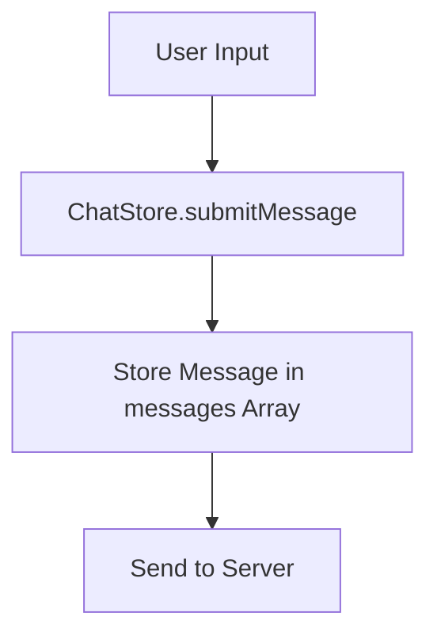
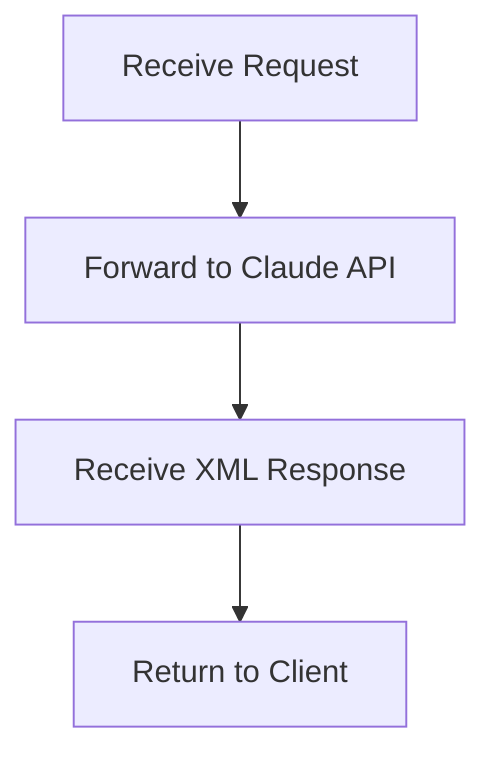
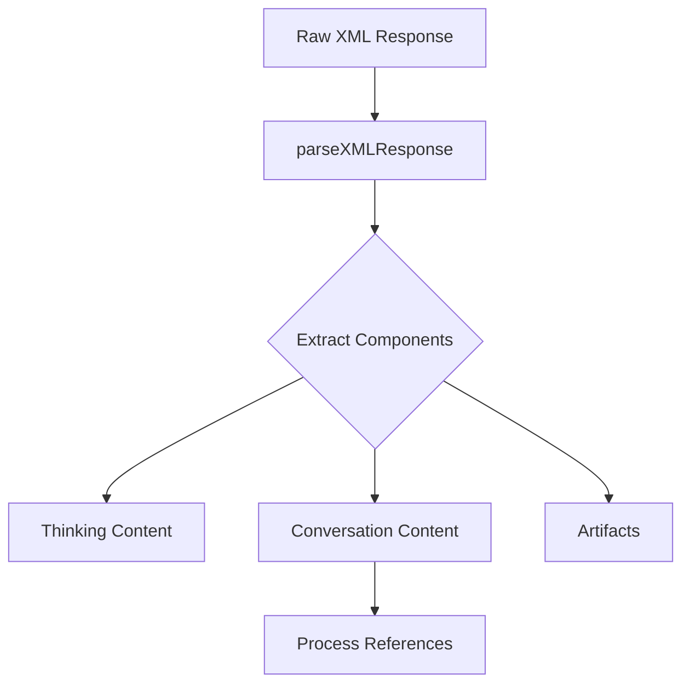
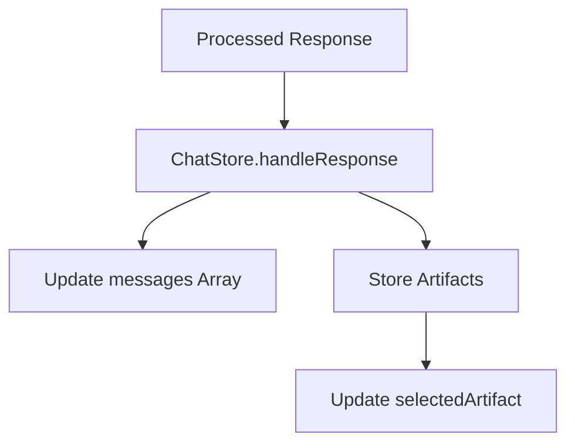
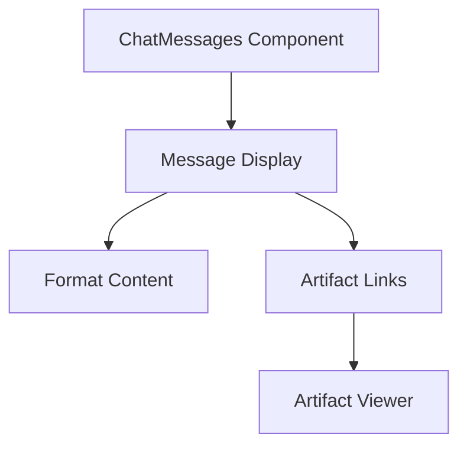

# Chat Data Flow Documentation

## Overview
This document describes the complete flow of chat data in the MCP (Model Control Protocol) application, from user input to display, including server interactions and data transformations.

## Claude Prompt Context
The system is designed to work with Claude, which has been prompted to structure its responses in XML format with specific tags:
- `<thinking>`: Optional internal reasoning/planning (displayed at message top)
- `<conversation>`: Main response content
- `<ref artifact="id">`: References to artifacts
- `<artifact>`: Generated content like code, diagrams, etc.

## Data Flow Sequence

### 1. Chat Submission


#### Details:
- User message stored immediately with role='user'
- Generates unique message ID
- Updates UI to show pending state

### 2. Server Processing


#### Details:
- Maintains conversation context
- Ensures response is in expected XML format
- Handles any Claude API errors

### 3. XML Response Processing


#### Component Processing:
a) **Thinking Content**:
   - Optional planning/reasoning text
   - Prepended to conversation with separator
   - Will be styled as blockquote in future

b) **Conversation Content**:
   - Main response text
   - Preserves whitespace and formatting
   - Processes special tags:
     - `<ref>` → `[description](artifact:id)`
     - `<code>` → Markdown code blocks

c) **Artifacts**:
   - Generated content (code, diagrams, etc.)
   - Each has:
     - Unique ID
     - Type (validated against allowed types)
     - Title
     - Content

### 4. Store Updates


#### State Management:
- Messages array updated with assistant's response
- Artifacts stored separately in artifacts map
- References maintained for artifact linking
- Selected artifact updated if relevant

### 5. Display Rendering


#### UI Components:
- Messages displayed with proper spacing/formatting
- References rendered as clickable links
- Artifacts accessible through reference links
- Thinking content shown at top of message

## Type Definitions

### Key Interfaces:
```typescript
interface XMLResponse {
  thinking?: string;
  conversation: string;
  artifacts: XMLArtifact[];
}

interface XMLArtifact {
  type: ArtifactType;
  id: string;
  title: string;
  content: string;
}

interface Message {
  id: string;
  role: 'user' | 'assistant';
  content: string;
  artifactId?: string;
}
```

## Data Transformation Example

Raw XML:
```xml
<response>
  <thinking>Planning to create a diagram...</thinking>
  <conversation>Here's a flowchart <ref artifact="diagram1">System Flow</ref>
  </conversation>
  <artifact type="image/svg+xml" id="diagram1" title="System Flow">
    <svg>...</svg>
  </artifact>
</response>
```

Processed Output:
```typescript
{
  thinking: "Planning to create a diagram...",
  conversation: "Here's a flowchart [System Flow](artifact:diagram1)",
  artifacts: [{
    type: "image/svg+xml",
    id: "diagram1",
    title: "System Flow",
    content: "<svg>...</svg>"
  }]
}
```

## Chat Store Structure

The chat state is managed in ChatStore using Zustand, with the following structure:

```typescript
interface ChatStore {
  // Core Message State
  messages: Message[];              // Array of all messages in the conversation
  artifacts: Map<string, Artifact>; // Map of all artifacts by their ID
  selectedArtifact: string | null;  // Currently selected artifact ID
  
  // UI State
  isLoading: boolean;              // Whether a response is being generated
  error: string | null;            // Any error messages
  
  // Actions
  submitMessage: (content: string) => Promise<void>;
  handleResponse: (response: XMLResponse) => void;
  selectArtifact: (id: string | null) => void;
  clearMessages: () => void;
}

// Example of store state:
{
  messages: [
    {
      id: "msg1",
      role: "user",
      content: "Create a system diagram"
    },
    {
      id: "msg2",
      role: "assistant",
      content: "I should create a diagram to illustrate the system architecture.\n\n---\n\nHere's a system architecture diagram that shows the main components:\n\n[System Architecture](artifact:diagram1)\n\nThe diagram shows the key interactions between the frontend and backend components."
    }
  ],
  artifacts: Map(1) {
    "diagram1" => {
      type: "image/svg+xml",
      id: "diagram1",
      title: "System Architecture",
      content: "<svg>...</svg>"
    }
  },
  selectedArtifact: "diagram1",
  isLoading: false,
  error: null
}
```

Key points about the store:
- Messages maintain chronological order
- Artifacts are stored separately for efficient access
- Selected artifact tracks currently viewed artifact
- Loading and error states manage UI feedback
- Actions encapsulate all state modifications

## Error Handling
- XML parsing errors trigger error state
- Invalid artifact types default to 'text/markdown'
- Missing conversation element throws error
- Server errors handled in chat store

## Future Enhancements
- Markdown rendering for conversation content
- Blockquote styling for thinking content
- Enhanced artifact type validation
- Real-time artifact updates 

## Current Display Format

When a response is displayed in the chat UI, it follows this format:

```
[Thinking Content (if present)]

---

[Main Conversation Content]
```

Example of how it appears:
```
I should create a diagram to illustrate the system architecture.

---

Here's a system architecture diagram that shows the main components:

[System Architecture](artifact:diagram1)

The diagram shows the key interactions between the frontend and backend components.

Key formatting details:
- Thinking content appears at the top
- Double newline + separator line (`---`) + double newline between thinking and conversation
- References appear as clickable links in their original position in the text
- Whitespace and line breaks are preserved
- Code blocks are formatted with triple backticks and language specification

## Error Handling 