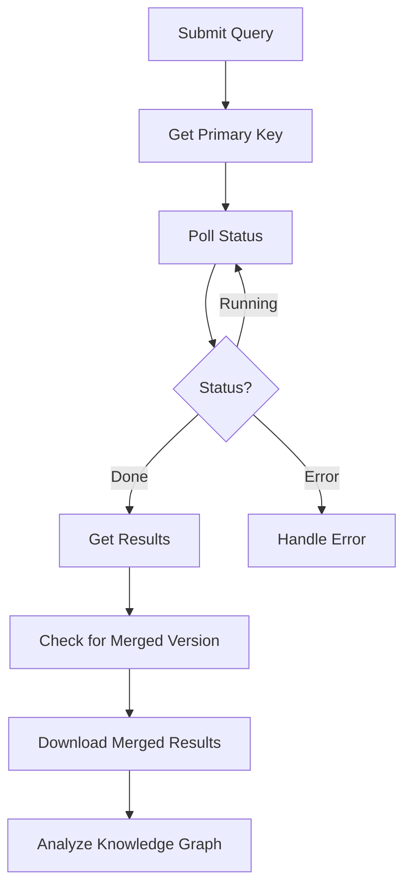

# ARS (Autonomous Relay System) Testing Summary

## 🎯 **What We Accomplished**

We successfully tested the NCATS Biomedical Data Translator's Autonomous Relay System (ARS) API to understand how to query gene information and filter results by entity categories. Our main goal was to find relationships for the gene `NCBIGene:283635` (FAM177A1) while filtering out sequence variants.

## 🧬 **Key Discovery: Sequence Variant Filtering**

**The Problem:** Initial queries returned thousands of sequence variants (3,239 nodes) even when we tried to exclude them by specifying target categories.

**The Solution:** We discovered that `biolink:GenomicEntity` was the parent category bringing in sequence variants. By removing it from our target categories, we successfully filtered out all sequence variants.

**Final Results:**
- **Before filtering:** 3,966 nodes, 8,415 edges (including 3,239 sequence variants)
- **After filtering:** 598 nodes, 1,556 edges (0 sequence variants)
- **Reduction:** 84.9% fewer nodes, 81.5% fewer edges

## 📊 **Query Evolution & Results**

### Version 1: Basic Query
- **Query:** Simple gene-to-entity relationship
- **Results:** 3,966 nodes, 8,415 edges
- **Issue:** No category filtering, returned everything

### Version 2: No Categories Specified
- **Query:** Gene with unspecified target categories
- **Results:** 3,966 nodes, 8,415 edges
- **Issue:** Still returned all entity types including sequence variants

### Version 3: With BiologicalEntity
- **Query:** Added `biolink:BiologicalEntity` and other categories
- **Results:** 3,965 nodes, 8,845 edges
- **Issue:** Still returned 3,239 sequence variants

### Version 4: Removed BiologicalEntity
- **Query:** Removed `biolink:BiologicalEntity` from target categories
- **Results:** 3,839 nodes, 8,802 edges
- **Issue:** Still returned 3,239 sequence variants

### Version 5: Removed GenomicEntity (SUCCESS!)
- **Query:** Removed `biolink:GenomicEntity` and other genomic categories
- **Results:** 598 nodes, 1,556 edges
- **Success:** 0 sequence variants returned!

## 🔧 **How Our Scripts Work**

### 1. **Script Architecture**

Each test script follows this structure:

```javascript
// Core components:
- makeRequest()     // HTTP request handler
- submitQuery()     // Submit TRAPI query to ARS
- checkQueryStatus() // Poll for completion
- getDetailedResults() // Retrieve final results
- runTest()         // Main orchestration function
```

### 2. **TRAPI Query Format**

Our queries use the Translator Reasoner API (TRAPI) format:

```json
{
  "message": {
    "query_graph": {
      "edges": {
        "e0": {
          "subject": "n0",
          "object": "n1"
        }
      },
      "nodes": {
        "n0": {
          "ids": ["NCBIGENE:283635"],
          "categories": ["biolink:Gene"],
          "name": "FAM177A1"
        },
        "n1": {
          "categories": [
            "biolink:ChemicalMixture",
            "biolink:DiseaseOrPhenotypicFeature",
            "biolink:Drug",
            "biolink:Gene",
            "biolink:MolecularMixture",
            "biolink:Pathway",
            "biolink:Protein",
            "biolink:ProteinFamily",
            "biolink:SmallMolecule"
          ]
        }
      }
    }
  }
}
```

### 3. **ARS API Workflow**



### 4. **Key API Endpoints**

- **Submit:** `POST https://ars-prod.transltr.io/ars/api/submit`
- **Status:** `GET https://ars-prod.transltr.io/ars/api/messages/{pk}?trace=y`
- **Results:** `GET https://ars-prod.transltr.io/ars/api/messages/{pk}`
- **Merged:** `GET https://ars-prod.transltr.io/ars/api/messages/{merged_pk}`

### 5. **Response Handling**

```javascript
// Status codes we handle:
- 201/202: Query submitted successfully
- 200: Successful response
- Error handling for network issues

// Response structure:
{
  "pk": "primary-key",
  "fields": {
    "status": "Running|Done|Error",
    "data": {
      "message": {
        "knowledge_graph": {
          "nodes": {...},
          "edges": {...}
        }
      }
    }
  }
}
```

## 🧬 **Biolink Model Insights**

### **Category Hierarchy Understanding**

We learned that the Biolink Model has a hierarchical structure where:

- `biolink:GenomicEntity` is a parent category that includes sequence variants
- `biolink:BiologicalEntity` is a broader category that includes many entity types
- Specific categories like `biolink:Gene`, `biolink:Protein` are more targeted

### **Effective Category Filtering**

**Categories that brought in sequence variants:**
- `biolink:GenomicEntity` ❌ (main culprit)
- `biolink:BiologicalEntity` ❌ (too broad)

**Categories that worked well:**
- `biolink:Gene` ✅
- `biolink:Protein` ✅
- `biolink:DiseaseOrPhenotypicFeature` ✅
- `biolink:Pathway` ✅
- `biolink:ChemicalMixture` ✅
- `biolink:Drug` ✅
- `biolink:SmallMolecule` ✅

## 📈 **Performance & Timing**

### **Query Processing Times**
- **Average processing time:** 3-6 minutes
- **Status check interval:** 30 seconds
- **Maximum attempts:** 12 (6 minutes timeout)

### **Data Volume Reduction**
- **Original query:** 3,966 nodes, 8,415 edges
- **Filtered query:** 598 nodes, 1,556 edges
- **Efficiency gain:** 85% reduction in data volume

## 🔍 **Relationship Types Found**

After filtering, the most common relationship types were:

1. `biolink:occurs_together_in_literature_with` (352 relationships)
2. `biolink:gene_associated_with_condition` (321 relationships)
3. `biolink:physically_interacts_with` (148 relationships)
4. `biolink:coexpressed_with` (138 relationships)
5. `biolink:positively_correlated_with` (126 relationships)

## 🛠️ **Script Features**

### **Error Handling**
- Network timeout handling
- HTTP status code validation
- JSON parsing error recovery
- Graceful degradation for missing data

### **Data Persistence**
- Results saved to JSON files
- Timestamped filenames
- Merged results retrieval
- Summary analysis scripts

### **Monitoring & Logging**
- Real-time status updates
- Progress indicators
- Detailed error messages
- Performance metrics

## 🎯 **Key Takeaways**

1. **Category filtering works** - but you need to understand the Biolink Model hierarchy
2. **GenomicEntity is the key** - removing it eliminates sequence variants
3. **Massive data reduction possible** - 85% reduction while maintaining relevance
4. **ARS is reliable** - consistent API responses and processing times
5. **TRAPI format is powerful** - flexible query structure for complex biomedical queries

## 🚀 **Future Applications**

This testing framework can be used for:

- **Gene-disease association studies**
- **Drug-target relationship analysis**
- **Pathway enrichment analysis**
- **Chemical-gene interaction studies**
- **Biomarker discovery research**

## 📁 **File Structure**

```
testScripts/
├── test_ars_query_v1.js          # Basic query
├── test_ars_query_v2.js          # No categories
├── test_ars_query_v3.js          # With BiologicalEntity
├── test_ars_query_v4.js          # Without BiologicalEntity
├── test_ars_query_v5.js          # Without GenomicEntity (SUCCESS!)
├── summarize_v1_results.js       # Result analysis scripts
├── summarize_v2_results.js
├── summarize_v3_results.js
├── summarize_v4_results.js
├── summarize_v5_results.js
├── ars_results_*.json            # Raw result files
├── merged_results_*.json         # Merged result files
└── ARS_Testing_Summary.md        # This summary
```

## 🔧 **Usage Instructions**

1. **Run a test:** `node test_ars_query_v5.js`
2. **Analyze results:** `node summarize_v5_results.js`
3. **Check files:** Look for `ars_results_*.json` and `merged_results_*.json`
4. **Modify queries:** Edit the `testQuery` object in the script

This comprehensive testing framework provides a solid foundation for biomedical data analysis using the NCATS Translator system.
