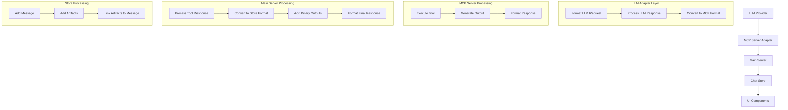
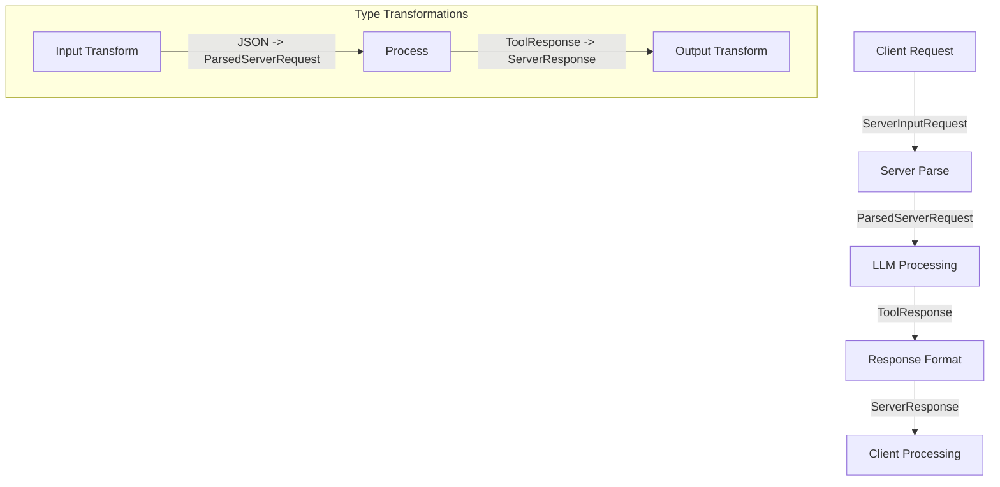

# Chat and Artifact Processing Flow

## Overview
This document serves as a comprehensive blueprint for implementing LLM server components that integrate with the MCP (Model Context Protocol) system. It details the complete flow of chat messages and artifacts, data transformations, and integration requirements for new LLM providers.

## 1. Data Flow Overview



## 2. Integration Requirements

### 2.1 LLM Adapter Interface
```typescript
interface LLMAdapter {
  // Required Methods
  initialize(config: AdapterConfig): Promise<void>;
  processMessage(message: string, history: ChatMessage[]): Promise<LLMResponse>;
  
  // Optional Methods
  validateResponse?(response: unknown): boolean;
  handleError?(error: Error): LLMResponse;
}

interface AdapterConfig {
  apiKey?: string;
  model?: string;
  endpoint?: string;
  maxTokens?: number;
  temperature?: number;
  // Add other LLM-specific configurations
}

interface LLMResponse {
  content: Array<{
    type: "text" | "tool_use";
    text?: string;
    name?: string;
    input?: Record<string, unknown>;
  }>;
  metadata?: {
    usage?: {
      promptTokens?: number;
      completionTokens?: number;
      totalTokens?: number;
    };
    model?: string;
    // Add other LLM-specific metadata
  };
}
```

## 3. Response Format Requirements

### 3.1 Standard Text Response
```typescript
{
  content: [{
    type: "text",
    text: string,
    metadata?: {
      hasBinaryOutput?: boolean,
      binaryType?: string
    }
  }],
  isError: boolean
}
```

### 3.2 Binary Output Response
```typescript
{
  content: [{
    type: "text",
    text: string,
    metadata: {
      hasBinaryOutput: true,
      binaryType: string
    }
  }],
  binaryOutput: {
    type: string,
    data: string,
    metadata: {
      size?: number,
      sourceCode?: string
    }
  },
  isError: boolean
}
```

### 3.3 Tool Response Format
```typescript
interface ToolResponse {
  type: 'tool_use';
  name: string;
  input: {
    thinking?: string;
    conversation: Array<{
      type: 'text' | 'artifact';
      content?: string;
      metadata?: {
        hasBinaryOutput?: boolean;
        binaryType?: string;
        [key: string]: any;
      };
      artifact?: {
        type: string;
        id: string;
        title: string;
        content: string;
        language?: string;
      };
    }>;
  };
  binaryOutput?: {
    type: string;
    data: string;
    metadata: {
      size?: number;
      sourceCode?: string;
      [key: string]: any;
    };
  };
}
```

## 4. Server Processing Steps

### 4.1 Tool Response Processing
Location: `src/server/index.ts`

1. **Initial Tool Execution**
   ```typescript
   const toolResult = await client.callTool({
     name: toolName,
     arguments: content.input
   });
   ```

2. **Binary Output Collection**
   - Binary outputs are collected in `messages.binaryOutputs` array
   - Each binary output includes:
     - Original data
     - Source code (if available)
     - Metadata

### 4.2 Store Format Conversion
Location: `src/server/index.ts` - `convertToStoreFormat` function

1. **Artifact Creation**
   ```typescript
   {
     id: string,
     artifactId: string,
     type: string,
     title: string,
     content: string,
     position: number,
     language?: string
   }
   ```

2. **Type Validation**
   - Uses `validateArtifactType` to normalize artifact types
   - Handles special cases:
     - Code artifacts
     - Binary outputs
     - Markdown content

3. **Button Generation**
   ```html
   <button 
     class="artifact-button text-sm text-blue-600 dark:text-blue-400 hover:underline" 
     data-artifact-id="${id}" 
     data-artifact-type="${type}" 
     style="cursor: pointer; background: none; border: none; padding: 0;">
     📎 ${title}
   </button>
   ```

## 5. Store Processing

### 5.1 Message Storage
Location: `src/store/chatStore.ts`

1. **Message Format**
   ```typescript
   interface MessageWithThinking {
     role: 'user' | 'assistant';
     content: string;
     id: string;
     timestamp: Date;
     thinking?: string;
     artifactId?: string;
   }
   ```

2. **Artifact Storage**
   ```typescript
   interface Artifact {
     id: string;
     artifactId: string;
     type: string;
     title: string;
     content: string;
     position: number;
     language?: string;
   }
   ```

### 5.2 Processing Flow
1. **Message Addition**
   ```typescript
   addMessage: (message) => set((state) => ({
     messages: [...state.messages, {
       ...message,
       id: crypto.randomUUID(),
       timestamp: new Date()
     }]
   }))
   ```

2. **Artifact Addition**
   ```typescript
   addArtifact: (artifact) => {
     set((state) => ({
       artifacts: [...state.artifacts, {
         ...artifact,
         timestamp: new Date()
       }].sort((a, b) => a.position - b.position)
     }));
     return artifact.id;
   }
   ```

### 5.3 Server Communication
Location: `src/store/chatStore.ts` - `processMessage` function

1. **Message Preparation and Sending**
   ```typescript
   processMessage: async (content: string) => {
     try {
       // Set loading state
       set({ 
         isLoading: true, 
         error: null,
         streamingContent: '',
         streamingComplete: false
       });
       
       // Create new message placeholder
       const messageId = crypto.randomUUID();
       const newMessage: MessageWithThinking = {
         role: 'assistant',
         content: '',
         id: messageId,
         timestamp: new Date()
       };
       
       // Add placeholder message to state
       set(state => ({
         messages: [...state.messages, newMessage],
         streamingMessageId: messageId,
         streamingContent: ''
       }));

       // Send request to server
       const response = await fetch(`${import.meta.env.VITE_API_URL}/api/chat`, {
         method: 'POST',
         headers: {
           'Content-Type': 'application/json',
         },
         body: JSON.stringify({
           message: content,
           history: get().messages
             .filter(msg => msg.content.trim() !== '')
             .map(msg => ({
               role: msg.role,
               content: msg.content
             })),
           blockedServers: useMCPStore.getState().getBlockedServers()
         })
       });

       // Process response
       const data = await response.json();
       const storeResponse = data.response;
       
       // Handle streaming or direct content update
       // [Content processing details...]
       
     } catch (error) {
       console.error('ChatStore: Error processing message:', error);
       set({ 
         error: error instanceof Error ? error.message : 'Unknown error',
         isLoading: false,
         streamingMessageId: null,
         streamingContent: '',
         streamingComplete: true
       });
     }
   }
   ```

2. **Request Format**
   ```typescript
   interface ChatRequest {
     message: string;              // Current message being sent
     history: Array<{             // Chat history
       role: 'user' | 'assistant';
       content: string;
     }>;
     blockedServers?: string[];   // Optional server restrictions
   }
   ```

3. **Response Processing**
   - Handles streaming responses if enabled
   - Updates message content progressively
   - Processes artifacts and binary outputs
   - Manages bibliography data
   - Updates UI state

4. **State Management During Communication**
   ```typescript
   interface CommunicationState {
     isLoading: boolean;          // Request in progress
     error: string | null;        // Error state
     streamingMessageId: string | null;  // Current streaming message
     streamingContent: string;    // Accumulated content
     streamingComplete: boolean;  // Stream status
   }
   ```

## 6. Special Cases

### 6.1 Binary Outputs
1. **Collection**
   - Stored in `messages.binaryOutputs` array
   - Includes both binary data and source code

2. **Processing**
   - Added to artifacts array
   - Buttons generated for both binary output and source code
   - Linked in conversation if not already present

### 6.2 Bibliography
1. **Collection**
   - Stored in `messages.bibliography` array
   - Deduplicated based on PMID

2. **Processing**
   - Added as special artifact type
   - Linked at end of conversation

## 7. UI Integration

### 7.1 Artifact Display
1. **Button Generation**
   - Embedded in conversation text
   - Contains metadata for artifact linking

2. **Artifact Window**
   - Shows selected artifact
   - Maintains artifact state

### 7.2 State Management
1. **Selection**
   ```typescript
   selectArtifact: (id) => set({ 
     selectedArtifactId: id,
     showArtifactWindow: true 
   })
   ```

2. **Visibility**
   ```typescript
   toggleArtifactWindow: () => set((state) => ({
     showArtifactWindow: !state.showArtifactWindow
   }))
   ```

## 8. Data Flow Example

### 8.1 Python Code with PNG Output
```typescript
// 1. MCP Server Response
{
  content: [{
    type: "text",
    text: "Generated PNG output...",
    metadata: { hasBinaryOutput: true }
  }],
  binaryOutput: {
    type: "image/png",
    data: "base64...",
    metadata: { sourceCode: "python..." }
  }
}

// 2. Store Format
{
  thinking: "...",
  conversation: "... <button>...</button>",
  artifacts: [{
    id: "...",
    type: "image/png",
    content: "base64...",
    position: 0
  }, {
    id: "...",
    type: "application/vnd.ant.python",
    content: "python...",
    position: 1
  }]
}
```

## 9. Important Notes

1. **Artifact ID Management**
   - UUIDs used for unique identification
   - Separate IDs for binary output and source code
   - IDs preserved in button attributes

2. **Type Normalization**
   - Consistent type strings used throughout
   - Special handling for Python code artifacts
   - Binary types preserved as-is

3. **Position Management**
   - Artifacts ordered by position
   - New artifacts appended to end
   - Positions used for display order

4. **Button Integration**
   - Generated for all artifacts
   - Added inline for referenced artifacts
   - Added at end for unreferenced artifacts

## 10. Implementation Guide for New LLM Providers

### 10.1 Required Components

1. **Adapter Implementation**
   ```typescript
   class NewLLMAdapter implements LLMAdapter {
     private config: AdapterConfig;
     
     async initialize(config: AdapterConfig) {
       this.config = config;
       // Initialize LLM client/connection
     }
     
     async processMessage(message: string, history: ChatMessage[]) {
       // 1. Convert history to LLM's format
       // 2. Make API call to LLM
       // 3. Convert response to standard format
       // 4. Handle any LLM-specific features
       return convertedResponse;
     }
   }
   ```

2. **Message Format Conversion**
   ```typescript
   interface LLMSpecificFormat {
     // Define LLM's native format
   }
   
   function convertToLLMFormat(messages: ChatMessage[]): LLMSpecificFormat {
     // Convert standard messages to LLM format
   }
   
   function convertFromLLMFormat(response: LLMSpecificFormat): LLMResponse {
     // Convert LLM response to standard format
   }
   ```

### 10.2 Integration Checklist

1. **Message Processing**
   - [ ] Implement history conversion
   - [ ] Handle streaming if supported
   - [ ] Implement token counting
   - [ ] Handle rate limiting

2. **Response Handling**
   - [ ] Convert response format
   - [ ] Handle errors gracefully
   - [ ] Process binary outputs
   - [ ] Handle metadata

3. **Tool Integration**
   - [ ] Implement tool calling format
   - [ ] Handle tool responses
   - [ ] Process binary outputs
   - [ ] Manage tool state

4. **Error Handling**
   - [ ] API errors
   - [ ] Rate limits
   - [ ] Token limits
   - [ ] Network issues

### 10.3 Configuration Requirements

```typescript
interface LLMConfig {
  // Required
  provider: string;
  model: string;
  apiKey: string;
  
  // Optional
  endpoint?: string;
  maxTokens?: number;
  temperature?: number;
  timeout?: number;
  retries?: number;
  
  // Rate Limiting
  maxRequestsPerMinute?: number;
  maxTokensPerMinute?: number;
  
  // Streaming
  supportsStreaming?: boolean;
  streamChunkSize?: number;
  
  // Tools
  supportedTools?: string[];
  maxToolCalls?: number;
}
```

### 10.4 Testing Requirements

1. **Basic Functionality**
   - Message processing
   - History handling
   - Response formatting

2. **Tool Integration**
   - Tool calling
   - Tool response processing
   - Binary output handling

3. **Error Scenarios**
   - API errors
   - Rate limiting
   - Token limits
   - Network issues

4. **Performance**
   - Response time
   - Memory usage
   - Token usage

## 11. Validation and Testing

### 11.1 Response Validation
```typescript
function validateLLMResponse(response: unknown): boolean {
  // 1. Check response structure
  // 2. Validate content format
  // 3. Check required fields
  // 4. Validate metadata
  return isValid;
}
```

### 11.2 Integration Tests
```typescript
async function testLLMIntegration(adapter: LLMAdapter) {
  // 1. Test basic message processing
  // 2. Test history handling
  // 3. Test tool integration
  // 4. Test error handling
  // 5. Test binary output processing
}
```

## 12. Common Integration Pitfalls

1. **Format Mismatches**
   - Inconsistent message formats
   - Missing required fields
   - Incorrect type conversions

2. **State Management**
   - Tool state not preserved
   - History format issues
   - Metadata loss

3. **Error Handling**
   - Incomplete error coverage
   - Missing fallbacks
   - Incorrect error formats

4. **Performance**
   - Token counting issues
   - Rate limit violations
   - Memory leaks

## 13. Security Considerations

1. **API Key Management**
   - Secure storage
   - Key rotation
   - Access control

2. **Data Processing**
   - Input sanitization
   - Output validation
   - Content filtering

3. **Rate Limiting**
   - Request throttling
   - Token usage monitoring
   - Cost control 

## 14. Multi-Model Support Implementation

### 14.1 Store Enhancements
```typescript
interface ModelConfig {
  id: string;
  name: string;
  type: 'local' | 'remote';
  endpoint: string;
  isAvailable: boolean;
  settings: {
    temperature?: number;
    maxTokens?: number;
    streamingSupported?: boolean;
    // Model-specific settings
    [key: string]: any;
  };
}

interface ModelState {
  selectedModel: string;
  availableModels: ModelConfig[];
  modelStatus: Record<string, {
    isLoading: boolean;
    error: string | null;
    lastPing: Date;
  }>;
}

// Store additions
interface ChatStore extends /* existing store interface */ {
  modelState: ModelState;
  setSelectedModel: (modelId: string) => void;
  updateModelStatus: (modelId: string, status: Partial<ModelState['modelStatus'][string]>) => void;
  getModelEndpoint: () => string;
}

// Modified processMessage
processMessage: async (content: string) => {
  const endpoint = get().getModelEndpoint();
  const selectedModel = get().modelState.selectedModel;
  const modelConfig = get().modelState.availableModels.find(m => m.id === selectedModel);

  // Add model-specific headers or parameters
  const requestConfig = {
    method: 'POST',
    headers: {
      'Content-Type': 'application/json',
      'X-Model-Type': modelConfig.type,
      // Add other model-specific headers
    },
    body: JSON.stringify({
      message: content,
      history: get().messages,
      modelSettings: modelConfig.settings,
      // ... other request data
    })
  };

  // Rest of the implementation
  // ...
}
```

### 14.2 Configuration Management
```typescript
// config/models.ts
export const modelConfigurations: ModelConfig[] = [
  {
    id: 'anthropic-claude',
    name: 'Claude (Remote)',
    type: 'remote',
    endpoint: '${import.meta.env.VITE_API_URL}/api/chat',
    isAvailable: true,
    settings: {
      temperature: 0.7,
      maxTokens: 4000,
      streamingSupported: true
    }
  },
  {
    id: 'local-llama',
    name: 'Llama 2 (Local)',
    type: 'local',
    endpoint: 'http://localhost:3001/api/chat',
    isAvailable: false,  // Dynamically updated
    settings: {
      temperature: 0.7,
      maxTokens: 2000,
      streamingSupported: true,
      modelPath: '/path/to/model',
      quantization: '4bit'
    }
  }
];

// Health check function
async function checkModelAvailability(config: ModelConfig): Promise<boolean> {
  try {
    const response = await fetch(`${config.endpoint}/health`);
    return response.ok;
  } catch {
    return false;
  }
}
```

### 14.3 Error Handling Extensions
```typescript
// types/errors.ts
interface ModelError extends Error {
  modelId: string;
  type: 'connection' | 'resource' | 'timeout' | 'validation';
  retryable: boolean;
  resourceStats?: {
    memory?: number;
    cpu?: number;
    gpu?: number;
  };
}

// error-handler.ts
class ModelErrorHandler {
  async handleError(error: ModelError, store: ChatStore): Promise<void> {
    switch (error.type) {
      case 'connection':
        if (error.retryable) {
          await this.retryConnection(error.modelId);
        } else {
          this.switchToFallbackModel(store);
        }
        break;
      
      case 'resource':
        await this.handleResourceError(error);
        break;
      
      // ... other error types
    }
  }

  private async retryConnection(modelId: string): Promise<void> {
    // Implement retry logic
  }

  private switchToFallbackModel(store: ChatStore): void {
    // Switch to next available model
  }

  private async handleResourceError(error: ModelError): Promise<void> {
    // Handle resource constraints
  }
}
```

### 14.4 UI Components
```typescript
// components/ModelSelector.tsx
interface ModelSelectorProps {
  models: ModelConfig[];
  selectedModel: string;
  onModelSelect: (modelId: string) => void;
}

const ModelSelector: React.FC<ModelSelectorProps> = ({
  models,
  selectedModel,
  onModelSelect
}) => {
  return (
    <div className="model-selector">
      <select 
        value={selectedModel}
        onChange={(e) => onModelSelect(e.target.value)}
      >
        {models.map(model => (
          <option 
            key={model.id} 
            value={model.id}
            disabled={!model.isAvailable}
          >
            {model.name} {!model.isAvailable && '(Unavailable)'}
          </option>
        ))}
      </select>
      
      {/* Model Status Indicator */}
      <ModelStatusIndicator modelId={selectedModel} />
      
      {/* Model Settings Panel */}
      <ModelSettings modelId={selectedModel} />
    </div>
  );
};

// components/ModelStatusIndicator.tsx
interface ModelStatusIndicatorProps {
  modelId: string;
}

const ModelStatusIndicator: React.FC<ModelStatusIndicatorProps> = ({
  modelId
}) => {
  const status = useChatStore(state => state.modelState.modelStatus[modelId]);
  
  return (
    <div className="model-status">
      {status.isLoading && <LoadingSpinner />}
      {status.error && <ErrorIcon title={status.error} />}
      {!status.isLoading && !status.error && (
        <StatusIcon 
          type="success" 
          title={`Last successful ping: ${status.lastPing.toLocaleString()}`} 
        />
      )}
    </div>
  );
};

// components/ModelSettings.tsx
interface ModelSettingsProps {
  modelId: string;
}

const ModelSettings: React.FC<ModelSettingsProps> = ({
  modelId
}) => {
  const model = useChatStore(state => 
    state.modelState.availableModels.find(m => m.id === modelId)
  );
  
  if (!model) return null;
  
  return (
    <div className="model-settings">
      <h3>Model Settings</h3>
      <form>
        {Object.entries(model.settings).map(([key, value]) => (
          <SettingInput
            key={key}
            name={key}
            value={value}
            onChange={(newValue) => {
              // Update model settings
            }}
          />
        ))}
      </form>
    </div>
  );
};
```

This new section provides:
1. Store enhancements for model selection and management
2. Configuration system for different models
3. Extended error handling specific to different model types
4. UI components for model selection and status display

The implementation allows for:
- Seamless switching between local and remote models
- Model-specific configuration and settings
- Proper error handling and fallbacks
- Clear UI feedback about model status and availability

Would you like me to:
1. Add more details about any specific aspect?
2. Include more examples of model-specific configurations?
3. Add sections about performance monitoring or security?
4. Expand the error handling scenarios? 

## 15. Server Data Type Boundaries

### 15.1 Server Input Types
```typescript
// Request body type when entering the server
interface ServerInputRequest {
  message: string;
  history: Array<{
    role: 'user' | 'assistant';
    content: string;
  }>;
  blockedServers?: string[];
  modelSettings?: {
    temperature?: number;
    maxTokens?: number;
    [key: string]: any;
  };
}

// After parsing in the server
interface ParsedServerRequest {
  message: {
    content: string;
    role: 'user' | 'assistant';
  };
  history: ChatMessage[];
  modelConfig?: ModelConfig;
  blockedServers: string[];
}

interface ChatMessage {
  role: 'user' | 'assistant';
  content: string;
  id?: string;
  timestamp?: Date;
  thinking?: string;
  artifactId?: string;
}
```

### 15.2 Server Output Types
```typescript
// Response type leaving the server
interface ServerResponse {
  response: {
    thinking?: string;
    conversation: string;
    artifacts?: Array<{
      id: string;
      artifactId?: string;
      type: string;
      title: string;
      content: string;
      position: number;
      language?: string;
      sourceCode?: string;
    }>;
  };
  error?: {
    message: string;
    details?: any;
  };
}

// Binary output format
interface BinaryOutputResponse extends ServerResponse {
  response: {
    // ... includes standard response fields ...
    binaryOutput?: {
      type: string;
      data: string;  // Base64 encoded
      metadata: {
        size?: number;
        sourceCode?: string;
        [key: string]: any;
      };
    };
  };
}

// Bibliography output format
interface BibliographyResponse extends ServerResponse {
  response: {
    // ... includes standard response fields ...
    bibliography?: Array<{
      pmid: string;
      title: string;
      authors: string[];
      journal?: string;
      year?: number;
      doi?: string;
      [key: string]: any;
    }>;
  };
}
```

### 15.3 Data Flow Type Transformations


### 15.4 Type Validation Points
1. **Request Validation**
   ```typescript
   function validateServerRequest(req: unknown): ServerInputRequest {
     // 1. Check structure
     if (!isObject(req)) throw new Error('Invalid request format');
     
     // 2. Validate message
     if (typeof req.message !== 'string') {
       throw new Error('Message must be a string');
     }
     
     // 3. Validate history
     if (!Array.isArray(req.history)) {
       throw new Error('History must be an array');
     }
     
     // 4. Validate each history item
     req.history.forEach(item => {
       if (!isValidHistoryItem(item)) {
         throw new Error('Invalid history item format');
       }
     });
     
     return req as ServerInputRequest;
   }
   ```

2. **Response Validation**
   ```typescript
   function validateServerResponse(res: unknown): ServerResponse {
     // 1. Check basic structure
     if (!isObject(res) || !isObject(res.response)) {
       throw new Error('Invalid response format');
     }
     
     // 2. Validate conversation field
     if (typeof res.response.conversation !== 'string') {
       throw new Error('Conversation must be a string');
     }
     
     // 3. Validate artifacts if present
     if (res.response.artifacts) {
       if (!Array.isArray(res.response.artifacts)) {
         throw new Error('Artifacts must be an array');
       }
       
       res.response.artifacts.forEach(validateArtifact);
     }
     
     return res as ServerResponse;
   }
   ```

### 15.5 Type Safety Considerations
1. **Input Boundaries**
   - All incoming requests are validated against `ServerInputRequest`
   - History items are checked for required fields
   - Model settings are validated against allowed values

2. **Processing Boundaries**
   - Tool responses are validated against `ToolResponse`
   - Binary outputs are checked for valid encoding
   - Artifacts are validated for required fields

3. **Output Boundaries**
   - All responses conform to `ServerResponse`
   - Binary data is properly encoded
   - Error responses include required fields

4. **Type Guards**
   ```typescript
   function isValidHistoryItem(item: any): item is ChatMessage {
     return (
       typeof item === 'object' &&
       typeof item.role === 'string' &&
       ['user', 'assistant'].includes(item.role) &&
       typeof item.content === 'string'
     );
   }
   
   function isValidArtifact(artifact: any): artifact is ServerResponse['response']['artifacts'][0] {
     return (
       typeof artifact === 'object' &&
       typeof artifact.id === 'string' &&
       typeof artifact.type === 'string' &&
       typeof artifact.title === 'string' &&
       typeof artifact.content === 'string' &&
       typeof artifact.position === 'number'
     );
   }
   ```

This section ensures that:
1. All data types at server boundaries are clearly defined
2. Type transformations are documented
3. Validation points are specified
4. Type safety is maintained throughout the process

Would you like me to:
1. Add more detail about specific type validations?
2. Include examples of error responses?
3. Add more about type transformations?
4. Expand the type guards section? 