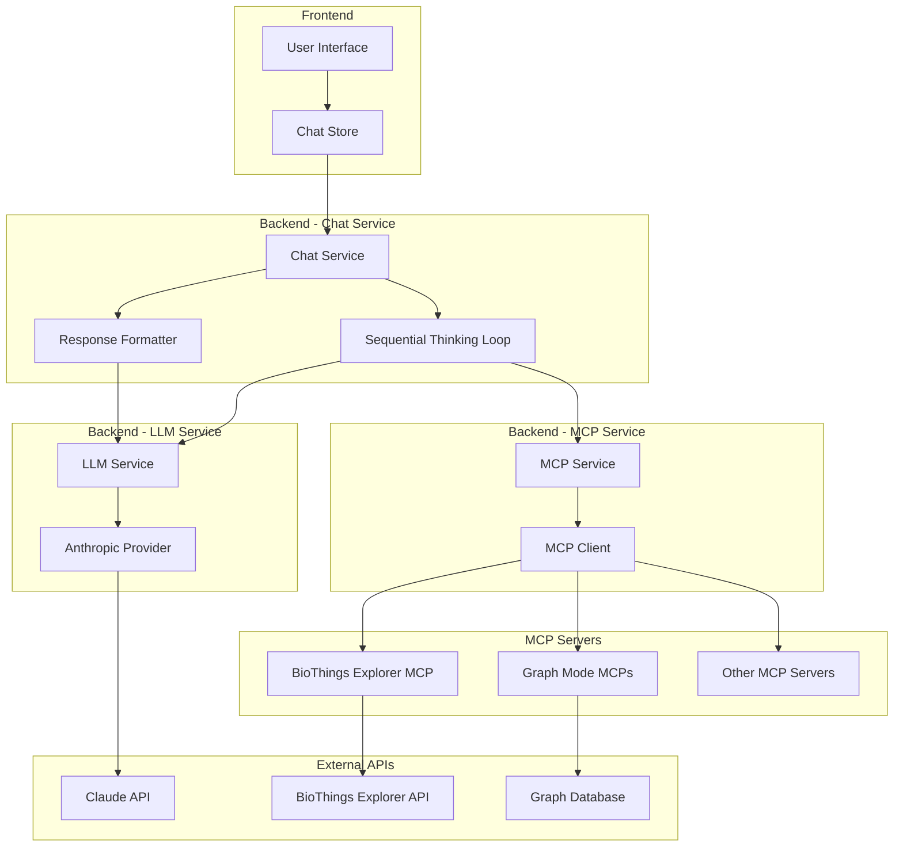
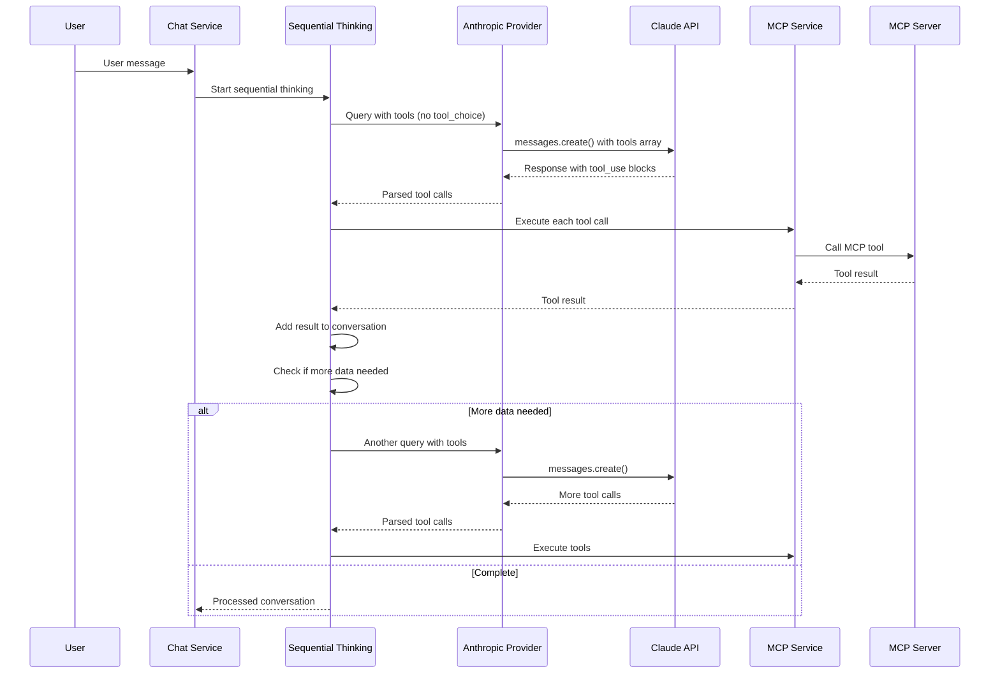
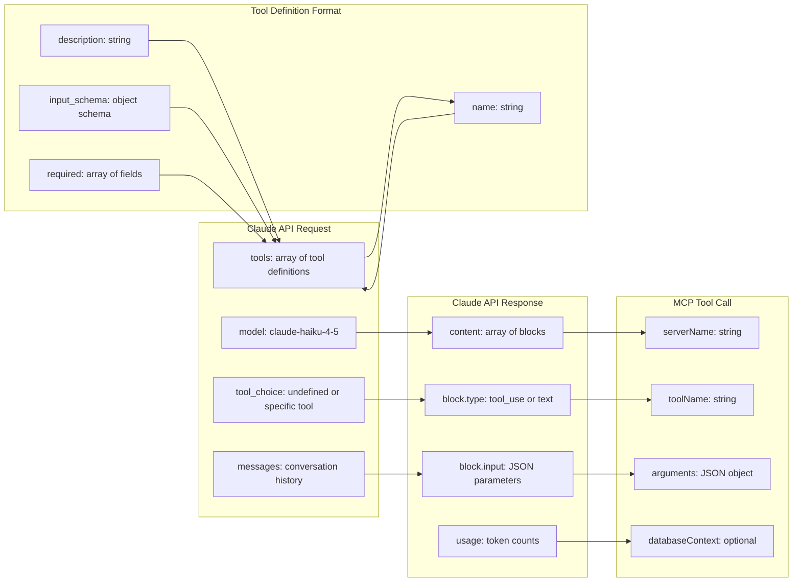
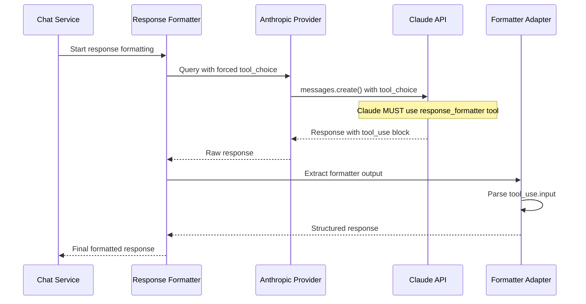

# MCP Tool Calling with Claude - Technical Reference

## Overview

This document details how the application uses Model Context Protocol (MCP) tools with Claude (Anthropic) specifically, including the data flow, file structure, and calling patterns that differ from other LLM providers.

## Architecture Overview



## File Structure

```
backend-mcp-client/src/services/
├── chat/
│   ├── index.ts                    # Main chat service with sequential thinking
│   │   ├── runSequentialThinking() # Multi-step tool calling loop
│   │   ├── buildSystemPromptWithContext() # System prompt builder
│   │   └── executeProcessChat()    # Main chat processing
│   ├── systemPrompt_tools.ts       # Tool calling system prompt
│   ├── formatters/
│   │   ├── anthropic.ts           # Claude-specific response formatter
│   │   │   ├── extractFormatterOutput() # Extract from tool_use blocks
│   │   │   └── convertToStoreFormat()   # Convert to final format
│   │   └── types.ts               # Formatter interfaces
│   └── adapters/
│       └── claude.ts              # Claude tool call adapter
│           ├── extractToolCalls() # Extract tool_use blocks
│           └── convertToolDefinitions() # Convert MCP to Claude format
├── llm/
│   └── providers/
│       └── anthropic.ts           # Claude API integration
│           ├── query()            # Main API call method
│           ├── Tool choice handling
│           └── Response processing
└── mcp/
    └── index.ts                   # MCP service for tool execution
        ├── getAllAvailableTools() # Get tools from MCP servers
        └── callTool()             # Execute MCP tool calls

custom-mcp-servers/graphModeMCPs/
├── graphmodeBTEMCP2/
│   └── src/index.ts               # BTE MCP server implementation
│       ├── ListToolsRequestSchema # Tool definitions
│       ├── CallToolRequestSchema  # Tool execution handlers
│       └── Tool implementations
└── graphmodeBaseMCP/
    └── src/index.ts               # Graph operations MCP server
        ├── analyzeNodeRelationships
        ├── getGraphState
        └── Other graph tools
```

## Key Code Locations

### Sequential Thinking Implementation
- **File**: `backend-mcp-client/src/services/chat/index.ts`
- **Method**: `runSequentialThinking()` (lines 964-2017)
- **Key Logic**: Multi-step loop with tool choice `undefined` for Claude

### Claude API Integration
- **File**: `backend-mcp-client/src/services/llm/providers/anthropic.ts`
- **Method**: `query()` (lines 59-199)
- **Key Logic**: Tool choice handling and response processing

### Tool Call Extraction
- **File**: `backend-mcp-client/src/services/chat/adapters/claude.ts`
- **Method**: `extractToolCalls()` 
- **Key Logic**: Extract `tool_use` blocks from Claude responses

### Response Formatting
- **File**: `backend-mcp-client/src/services/chat/formatters/anthropic.ts`
- **Method**: `extractFormatterOutput()` (lines 91-300)
- **Key Logic**: Parse `tool_use` blocks for response formatter

### MCP Tool Execution
- **File**: `backend-mcp-client/src/services/mcp/index.ts`
- **Method**: `callTool()` (lines 516-526)
- **Key Logic**: Execute MCP tools via stdio transport

## Claude-Specific Tool Calling Flow

### 1. Sequential Thinking Phase

**Purpose**: Multi-step tool execution with Claude deciding which tools to call

**Configuration**:
```typescript
// No forced tool choice - Claude can choose freely
const toolChoiceValue = undefined; // For Anthropic

// System prompt instructs Claude to gather information
const systemPrompt = toolCallingSystemPrompt + toolDescriptions;
```

**Claude API Call**:
```typescript
const response = await this.client.messages.create({
  model: 'claude-haiku-4-5',
  max_tokens: 4000,
  temperature: 0.2,
  messages: [
    { role: 'user', content: userMessage }
  ],
  tools: [/* MCP tool definitions */],
  // No tool_choice = Claude can choose tools freely
});
```

**Response Processing**:
```typescript
// Extract tool calls from Claude's response
if (block.type === 'tool_use') {
  content = JSON.stringify(block.input); // Tool call parameters as JSON
}
```

### 2. Response Formatting Phase

**Purpose**: Force Claude to use only the response formatter tool

**Configuration**:
```typescript
// Force Claude to use response_formatter tool
const toolChoice = { type: 'tool', name: 'response_formatter' };

// System prompt forces tool usage
const formatterSystemPrompt = basePrompt + `
You MUST use the response_formatter tool for ALL responses.
Do not respond directly with text, only use the response_formatter tool.
`;
```

**Claude API Call**:
```typescript
const response = await this.client.messages.create({
  model: 'claude-haiku-4-5',
  max_tokens: 4000,
  temperature: 0.2,
  messages: [
    { role: 'user', content: structuredPrompt }
  ],
  tools: [formatterToolDefinition],
  tool_choice: { type: 'tool', name: 'response_formatter' }
});
```

## Data Flow Diagrams

### Sequential Thinking Tool Call Flow



### Detailed Claude Tool Call Data Flow

```mermaid
graph TD
    A[User: "Find genes connected to MPO"] --> B[Chat Service]
    B --> C[Sequential Thinking Loop]
    C --> D[Anthropic Provider]
    D --> E[Claude API Call]
    
    E --> F[Claude Response]
    F --> G{Response Type?}
    
    G -->|tool_use block| H[Extract Tool Call]
    G -->|text block| I[Process Text Response]
    
    H --> J[Parse Tool Parameters]
    J --> K[Call MCP Service]
    K --> L[MCP Server Execution]
    L --> M[Tool Result]
    M --> N[Add to Conversation]
    N --> O{More Data Needed?}
    
    O -->|Yes| C
    O -->|No| P[Response Formatter Phase]
    
    P --> Q[Force response_formatter tool]
    Q --> R[Claude API with tool_choice]
    R --> S[Tool Use: response_formatter]
    S --> T[Extract JSON from tool.input]
    T --> U[Format Final Response]
    U --> V[Return to User]
    
    style E fill:#e1f5fe
    style F fill:#e8f5e8
    style S fill:#fff3e0
    style T fill:#f3e5f5
```

### Claude-Specific Data Format Flow



### Response Formatting Flow



## Data Formats

### 1. Tool Definition Format (Claude)

```typescript
interface ClaudeTool {
  name: string;
  description: string;
  input_schema: {
    type: "object";
    properties: Record<string, unknown>;
    required?: string[];
  };
}

// Example: BTE Query Tool
{
  name: "query_bte_getall",
  description: "Query BTE for ALL available entity types...",
  input_schema: {
    type: "object",
    properties: {
      entityId: {
        type: "string",
        description: "The entity ID to find connections for"
      },
      databaseContext: {
        type: "object",
        properties: {
          conversationId: { type: "string" },
          apiBaseUrl: { type: "string" },
          accessToken: { type: "string" }
        },
        required: ["conversationId"]
      }
    },
    required: ["entityId", "databaseContext"]
  }
}
```

### 2. Claude Tool Call Request

```typescript
// Claude API request format
{
  model: "claude-haiku-4-5",
  max_tokens: 4000,
  temperature: 0.2,
  messages: [
    { 
      role: "user", 
      content: "Find genes connected to MPO" 
    }
  ],
  tools: [
    {
      name: "query_bte_getall",
      description: "Query BTE for ALL available entity types...",
      input_schema: { /* ... */ }
    }
  ],
  // Sequential thinking: no tool_choice (Claude chooses)
  // Response formatting: tool_choice: { type: "tool", name: "response_formatter" }
}
```

### 3. Claude Tool Call Response

```typescript
// Claude API response format
{
  content: [
    {
      type: "tool_use",
      id: "toolu_0123456789",
      name: "query_bte_getall",
      input: {
        entityId: "NCBIGene:4353",
        databaseContext: {
          conversationId: "conv_123",
          apiBaseUrl: "http://localhost:3001",
          accessToken: "token_456"
        }
      }
    }
  ],
  usage: {
    input_tokens: 150,
    output_tokens: 50
  }
}
```

### 4. MCP Tool Call Format

```typescript
// MCP service call format
await mcpService.callTool(
  "graphmode-bte-mcp-v2",  // server name
  "query_bte_getall",      // tool name
  {
    entityId: "NCBIGene:4353",
    databaseContext: {
      conversationId: "conv_123",
      apiBaseUrl: "http://localhost:3001",
      accessToken: "token_456"
    }
  }
);
```

### 5. Response Formatter Tool Call

```typescript
// Claude's call to response_formatter tool
{
  type: "tool_use",
  id: "toolu_response_formatter",
  name: "response_formatter",
  input: {
    thinking: "I need to analyze the MPO gene relationships...",
    conversation: [
      {
        type: "text",
        content: "# MPO Gene Relationship Analysis\n\nYour graph shows..."
      }
    ]
  }
}
```

## Key Differences from Other LLMs

### OpenAI vs Claude

| Aspect | OpenAI | Claude |
|--------|--------|--------|
| Tool Choice | `tool_choice: "auto"` | `tool_choice: undefined` |
| Tool Definition | `type: "function"` | `type: "object"` with `input_schema` |
| Response Format | `tool_calls` array | `content` array with `tool_use` blocks |
| Tool Call Extraction | `response.choices[0].message.tool_calls` | `response.content.filter(block => block.type === 'tool_use')` |
| Forced Tool Use | `tool_choice: { type: "function", function: { name: "tool_name" } }` | `tool_choice: { type: "tool", name: "tool_name" }` |

### Gemini vs Claude

| Aspect | Gemini | Claude |
|--------|--------|--------|
| Tool Choice | No tool_choice support | `tool_choice: { type: 'tool', name: 'tool_name' }` |
| Tool Definition | `functionDeclarations` array | `tools` array with `input_schema` |
| Response Format | `candidates[0].content.parts` | `content` array with `tool_use` blocks |
| Forced Tool Use | Not supported | Supported via `tool_choice` |
| Tool Call Structure | `functionCall` object | `tool_use` block with `input` |

### Ollama vs Claude

| Aspect | Ollama | Claude |
|--------|--------|--------|
| Tool Choice | Ignored (natural tool use) | `tool_choice: { type: 'tool', name: 'tool_name' }` |
| Tool Definition | OpenAI format | `input_schema` format |
| Response Format | `message.tool_calls` | `content` array with `tool_use` blocks |
| Forced Tool Use | Not supported | Supported via `tool_choice` |
| API Integration | Direct HTTP calls | Official SDK |

## Claude-Specific Implementation Details

### 1. Tool Definition Conversion

When MCP tools are converted for Claude, they use the `input_schema` format:

```typescript
// MCP Tool Definition (OpenAPI format)
{
  name: "query_bte_getall",
  description: "Query BTE for connections",
  inputSchema: {
    type: "object",
    properties: {
      entityId: { type: "string" },
      databaseContext: { type: "object" }
    },
    required: ["entityId", "databaseContext"]
  }
}

// Claude Tool Definition
{
  name: "query_bte_getall", 
  description: "Query BTE for connections",
  input_schema: {
    type: "object",
    properties: {
      entityId: { type: "string" },
      databaseContext: { type: "object" }
    },
    required: ["entityId", "databaseContext"]
  }
}
```

### 2. Response Processing Differences

```typescript
// OpenAI Response Processing
const toolCalls = response.choices[0].message.tool_calls || [];
toolCalls.forEach(toolCall => {
  const toolName = toolCall.function.name;
  const toolArgs = JSON.parse(toolCall.function.arguments);
});

// Claude Response Processing  
const toolCalls = response.content
  .filter(block => block.type === 'tool_use')
  .map(block => ({
    name: block.name,
    input: block.input,
    id: block.id
  }));
```

### 3. Tool Choice Implementation

```typescript
// Sequential Thinking (Claude chooses tools)
const requestOptions = {
  model: 'claude-haiku-4-5',
  messages: [{ role: 'user', content: prompt }],
  tools: toolDefinitions,
  // No tool_choice = Claude can choose freely
};

// Response Formatting (Force specific tool)
const requestOptions = {
  model: 'claude-haiku-4-5', 
  messages: [{ role: 'user', content: prompt }],
  tools: [formatterToolDefinition],
  tool_choice: { type: 'tool', name: 'response_formatter' }
};
```

## System Prompts

### Sequential Thinking Prompt

```typescript
export const toolCallingSystemPrompt = `
You are an AI assistant focused ONLY on gathering information to answer the user's question.

IMPORTANT INSTRUCTIONS:
1. Your ONLY role is to determine what data is needed and use tools to gather it.
2. DO NOT attempt to answer the user's question directly in this phase.
3. When the user specifies particular tools by name, you MUST use those exact tools.
4. Call appropriate tools to collect relevant information.
5. After each tool call, you should STOP by default unless you need more data.
6. To continue with additional tool calls, you MUST include "NEED MORE DATA:" followed by explicit reasoning.
`;
```

### Response Formatter Prompt

```typescript
const formatterSystemPrompt = basePrompt + `
You MUST use the response_formatter tool for ALL responses. Follow these rules exactly:

1. CONVERSATION FIELD REQUIREMENTS:
   - The 'conversation' field MUST be an array of objects
   - NEVER return 'conversation' as a string or other type
   - Each object in the array MUST have a 'type' field
   - The 'type' field MUST be either "text" or "artifact"

2. FOR TEXT RESPONSES:
   Use this structure:
   {
     "type": "text",
     "content": "Your response text here in markdown format"
   }
`;
```

## Error Handling

### Tool Call Failures

```typescript
// MCP tool execution error handling
try {
  const toolResult = await this.mcpService.callTool(serverName, toolName, args);
  // Process successful result
} catch (error) {
  console.error(`Tool execution failed: ${error.message}`);
  // Add error to conversation for LLM to see
  workingMessages.push({
    role: 'user',
    content: `Tool ${toolName} failed: ${error.message}`
  });
}
```

### Response Formatter Errors

```typescript
// Handle malformed response formatter output
if (!formatterOutput.conversation) {
  console.warn('Missing conversation array - creating fallback');
  return {
    thinking: formatterOutput.thinking || "Formatter output was incomplete",
    conversation: [{
      type: 'text',
      content: "The model didn't provide a properly structured response"
    }]
  };
}
```

## Debugging

### Tool Call Logging

```typescript
// Log Claude's tool choice decisions
console.log('🔵 [ANTHROPIC-PROVIDER] Tool choice:', JSON.stringify(toolChoice, null, 2));

// Log tool execution
console.log(`🔍 TOOL-EXECUTION: Executing tool ${toolCall.name} (${serverName}:${toolName})`);
console.log(`🔍 TOOL-EXECUTION: Input: ${JSON.stringify(toolCall.input)}`);
```

### Response Analysis

```typescript
// Log Claude's response structure
console.log('🔍 DEBUG-ANTHROPIC-FORMATTER: Response structure:', JSON.stringify({
  hasContent: !!response.content,
  contentLength: response.content?.length || 0,
  contentTypes: response.content?.map(block => block.type).join(', ') || 'none'
}));
```

## Best Practices

### 1. Tool Choice Strategy
- **Sequential Thinking**: Use `tool_choice: undefined` to let Claude choose tools naturally
- **Response Formatting**: Use `tool_choice: { type: 'tool', name: 'response_formatter' }` to force formatting

### 2. Error Recovery
- Always handle tool execution failures gracefully
- Provide fallback responses when tools fail
- Log detailed error information for debugging

### 3. Performance Optimization
- Limit tool descriptions in system prompt (max 15 tools)
- Use background processing for long-running operations
- Implement proper timeout handling

### 4. Claude-Specific Considerations
- Claude uses `input_schema` instead of `parameters` for tool definitions
- Tool calls are in `content` array as `tool_use` blocks, not `tool_calls`
- Response extraction requires checking `block.type === 'tool_use'`
- Forced tool choice works reliably with `tool_choice` parameter

## Troubleshooting

### Common Issues

1. **Tool Choice Not Working**
   - Ensure `tool_choice` is properly formatted: `{ type: 'tool', name: 'tool_name' }`
   - Check that the tool name matches exactly
   - Verify tool is included in the `tools` array

2. **Malformed Response Formatting**
   - Verify system prompt includes explicit formatting instructions
   - Check that `tool_choice` forces the response formatter tool
   - Look for "Missing conversation array" errors in logs

3. **Tool Call Extraction Failures**
   - Ensure response processing checks for `block.type === 'tool_use'`
   - Verify tool call structure matches expected format
   - Check that `block.input` contains the tool parameters

4. **Infinite Tool Call Loops**
   - Implement tool call signature tracking
   - Add maximum iteration limits (MAX_THINKING_STEPS = 5)
   - Use "NEED MORE DATA:" pattern for continuation control

5. **Claude-Specific Issues**
   - **Tool definitions must use `input_schema`** not `parameters`
   - **Response extraction must check `block.type === 'tool_use'`**
   - **Tool choice format**: `{ type: 'tool', name: 'tool_name' }`
   - **No `tool_choice`** = Claude chooses tools freely

### Debug Logging

Enable detailed logging to troubleshoot issues:

```typescript
// Tool choice debugging
console.log('🔵 [ANTHROPIC-PROVIDER] Tool choice:', JSON.stringify(toolChoice, null, 2));

// Tool call extraction debugging
console.log('🔍 DEBUG-ANTHROPIC-FORMATTER: Response structure:', JSON.stringify({
  hasContent: !!response.content,
  contentLength: response.content?.length || 0,
  contentTypes: response.content?.map(block => block.type).join(', ') || 'none'
}));

// Tool execution debugging
console.log(`🔍 TOOL-EXECUTION: Executing tool ${toolCall.name} (${serverName}:${toolName})`);
console.log(`🔍 TOOL-EXECUTION: Input: ${JSON.stringify(toolCall.input)}`);
```

### Error Patterns

#### 1. "Missing conversation array" Error
```
⚠️ DEBUG-ANTHROPIC-FORMATTER: Missing conversation array - creating fallback
```
**Cause**: Claude is not properly calling the response_formatter tool
**Solution**: Check `tool_choice` configuration and system prompt

#### 2. Tool Call Not Extracted
```
🔍 DEBUG-ANTHROPIC-FORMATTER: No response_formatter tool use found
```
**Cause**: Claude returned text instead of tool_use block
**Solution**: Verify `tool_choice` is forcing tool use

#### 3. Infinite Loop Detection
```
🔍 SEQUENTIAL-THINKING: Detected repeated tool calls (step 2)
```
**Cause**: Same tool called with same parameters repeatedly
**Solution**: Check tool call signature tracking logic

### Performance Optimization

1. **Limit Tool Descriptions**: Max 15 tools in system prompt
2. **Background Processing**: Use for long-running operations
3. **Timeout Handling**: Implement proper timeouts for tool calls
4. **Caching**: Cache tool results when appropriate

### Testing Tool Calls

Test individual components:

```typescript
// Test Claude API call
const response = await anthropicProvider.query(prompt, {
  tools: [testToolDefinition],
  tool_choice: { type: 'tool', name: 'test_tool' }
});

// Test tool call extraction
const toolCalls = claudeAdapter.extractToolCalls(response.rawResponse);

// Test MCP tool execution
const result = await mcpService.callTool('server-name', 'tool-name', args);
```

## Summary

This application uses a sophisticated multi-step tool calling system with Claude that:

1. **Sequential Thinking Phase**: Claude chooses tools freely to gather information
2. **Response Formatting Phase**: Claude is forced to use the response_formatter tool
3. **MCP Integration**: Tools are executed via Model Context Protocol servers
4. **Claude-Specific Handling**: Uses `input_schema` format and `tool_use` blocks
5. **Error Recovery**: Comprehensive error handling and fallback mechanisms

The key difference from other LLMs is Claude's use of `tool_use` blocks in the `content` array rather than `tool_calls` arrays, and the `input_schema` format for tool definitions rather than `parameters`.
