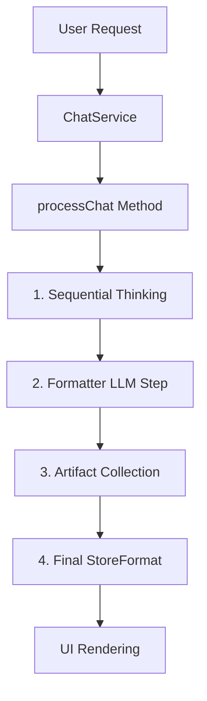
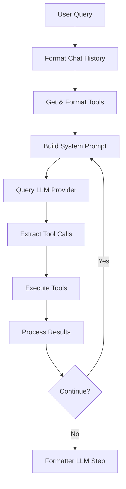
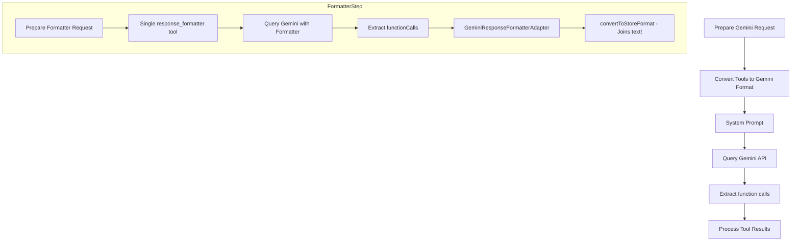
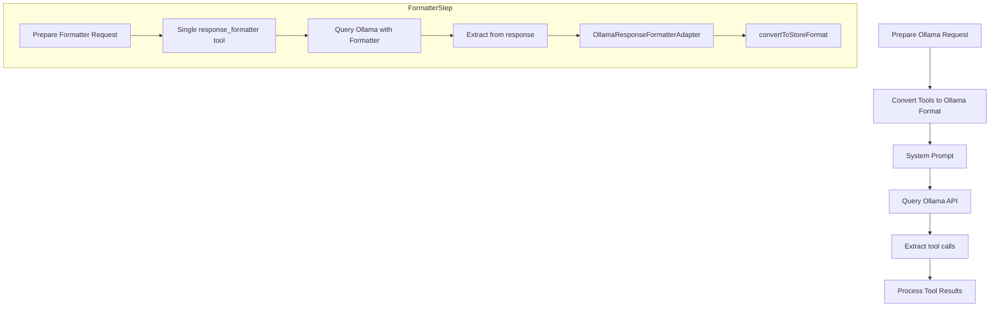
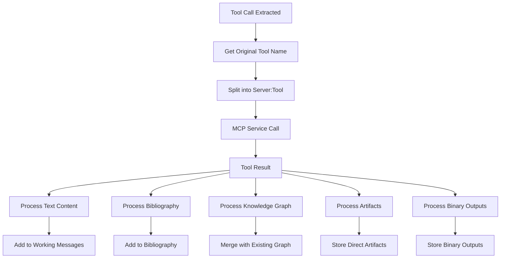
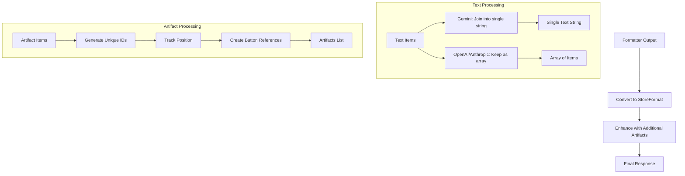
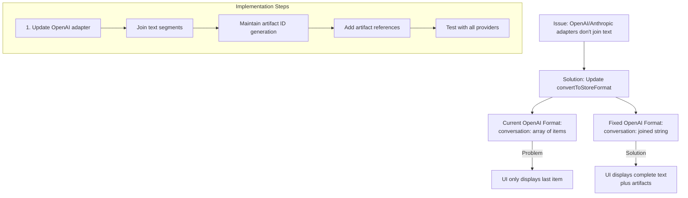

# LLM Model Calling Process & Data Flow Diagram

## Overview of ChatService Architecture



## Model Calling Process (By Provider)

### Common Process Flow



### Provider-Specific Variations

#### 1. OpenAI (GPT-4, etc.)

```mermaid
graph TD
    PrepareOpenAI[Prepare OpenAI Request] --> Tools[Convert Tools to OpenAI Format]
    Tools --> ToolChoice[toolChoice: "auto" or specific]
    ToolChoice --> SystemPrompt[System Prompt]
    SystemPrompt --> QueryOpenAI[Query OpenAI API]
    QueryOpenAI --> ExtractCalls[Extract function_call from response]
    ExtractCalls --> ProcessResults[Process Tool Results]
    
    subgraph FormatterStep
        PrepFormat[Prepare Formatter Request] --> FormatterTool[Single response_formatter tool]
        FormatterTool --> ForceToolChoice[toolChoice: {type: 'tool', name: 'response_formatter'}]
        ForceToolChoice --> QueryFormatter[Query OpenAI with Formatter]
        QueryFormatter --> ExtractFormat[Extract from function_call]
        ExtractFormat --> OpenAIAdapter[OpenAIResponseFormatterAdapter]
        OpenAIAdapter --> ConvertStore[convertToStoreFormat]
    end
```

#### 2. Anthropic (Claude)

```mermaid
graph TD
    PrepareAnthropic[Prepare Anthropic Request] --> Tools[Convert Tools to Anthropic Format]
    Tools --> SystemPrompt[System Prompt]
    SystemPrompt --> QueryAnthropic[Query Anthropic API]
    QueryAnthropic --> ExtractCalls[Extract tool_use blocks]
    ExtractCalls --> ProcessResults[Process Tool Results]
    
    subgraph FormatterStep
        PrepFormat[Prepare Formatter Request] --> FormatterTool[Single response_formatter tool]
        FormatterTool --> ForceToolChoice[toolChoice: {name: 'response_formatter'}]
        ForceToolChoice --> QueryFormatter[Query Anthropic with Formatter]
        QueryFormatter --> ExtractFormat[Extract from tool_use]
        ExtractFormat --> AnthropicAdapter[AnthropicResponseFormatterAdapter]
        AnthropicAdapter --> ConvertStore[convertToStoreFormat]
    end
```

#### 3. Gemini



#### 4. Ollama (Local Models)



## Tool Execution Flow



## Data Transformation Flow



## Key Issues & Fix Implementation

