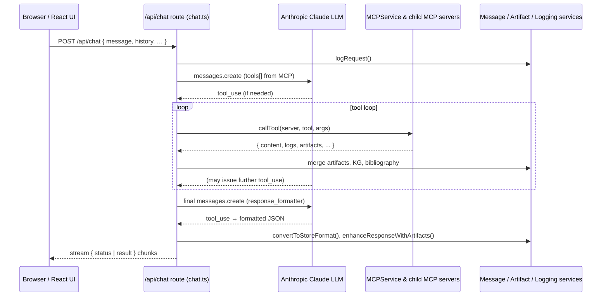

# GrantMode Server – Internal Architecture & Tooling Guide

> **Scope:** This document captures how the **Grant-Mode** (a.k.a. *Grant Review*) server fulfils a chat request, orchestrates MCP tools, and produces the final streaming response.  Keep this file close to the code so future contributors can quickly understand the moving pieces.

---

## 1. High-level Flow

---

## 2. Key Source Files

| Path | Responsibility |
|------|----------------|
| `src/server/routes/chat.ts` | Express endpoint. Manages the request lifecycle, streams status, loops over `tool_use`, merges artifacts, and returns final JSON. |
| `src/server/services/mcp.ts` | • Spawns each MCP server process. • Converts MCP tool JSON-Schema → Anthropic `tools` payload. • `callTool()` executes a tool and returns its structured result. • Forwards MCP `notifications/message` logs back to `chat.ts`. |
| `src/server/services/message.ts` | • `convertChatMessages()` ↔ Anthropic format. • `convertToStoreFormat()` turns the `response_formatter` output into the UI-ready shape. • `enhanceResponseWithArtifacts()` inserts bibliography, knowledge-graphs, images, etc. |
| `src/server/services/artifact.ts` | Converts raw binary outputs (PNG, PDF, etc.) into typed artifact objects that the UI can render. |
| `src/server/services/logging.ts` | Wraps console logging, rotates log files, captures every request/response/error. |
| `src/utils/knowledgeGraphUtils.ts` | Validates & merges multiple knowledge-graph artifacts. |
| `src/server/systemPrompt.ts` | Global system prompt appended on the final LLM call. |

---

## 3. Detailed Request Lifecycle

1. **Incoming Request**  
   The React client POSTs to `/api/chat` with `{ message, history, blockedServers?, pinnedGraph? }`.
2. **Logging & Init**  
   `LoggingService.logRequest()` spins up a new *chat* log file. Headers for HTTP streaming are set.
3. **Tool Discovery**  
   `MCPService.getAllAvailableTools()` loads every MCP tool (excluding any `blockedServers`). The returned array is fed into Claude as the `tools` parameter.
4. **First LLM Pass**  
   Claude thinks and may emit a `tool_use` message requesting execution of an MCP tool.
5. **Tool Execution Loop**  
   For each `tool_use`:
   - `chat.ts` calls `MCPService.callTool()`.
   - Tool results may include text, `artifacts`, `bibliography`, `knowledgeGraph`, `binaryOutput`, etc.
   - `ArtifactService` and `knowledgeGraphUtils` normalise / merge these pieces.
   - MCP log notifications are piped through `sendMCPLogMessage()` → streamed back to the UI as *status* messages.
   The loop repeats until no further `tool_use` blocks are produced.
6. **Response Formatting**  
   A final Claude call is made with a single `response_formatter` tool to ensure the answer is emitted in a strict JSON schema.  
   `MessageService.convertToStoreFormat()` + `enhanceResponseWithArtifacts()` build the payload expected by the frontend.
7. **Streaming Back to Client**  
   The endpoint streams `{ type: 'status' }` updates during processing and finally a `{ type: 'result', response: … }` object.

---

## 4. Artifacts & Attachment Types

| MIME / Custom Type | Description |
|--------------------|-------------|
| `text/markdown` | Markdown snippets such as generated grant sections |
| `application/vnd.bibliography` | JSON array of paper references |
| `application/vnd.knowledge-graph` | Nodes + links JSON graph |
| `image/svg+xml`, `image/png` | Binary or base64-encoded images |
| `application/vnd.react`, `application/vnd.ant.code`, `code/{lang}` | Interactive or code artifacts |

---

## 5. Hosting & Documentation Placement

Where should this doc live?

1. **Inside the repo (current choice)** – Placing it at the project root (`README.INFO.*`) mirrors the existing convention and ensures discoverability in code reviews.
2. **`/docs` directory** – You can move or symlink it into `docs/` if you adopt a static-site generator (e.g. Docusaurus or VitePress).  GitHub Pages can then serve `docs/` straight from the `main` branch.
3. **External knowledge-base** – For broader organisational docs, publish to Confluence, Notion, or a shared mkdocs site and link back to this canonical markdown.

> **Recommendation:** Keep the master copy in-repo (option 1 or 2) and, if you spin up a documentation site, auto-pull markdown from the repository so the docs stay version-controlled alongside the code.

---

## 6. Future Improvements

- **Typed Tool Responses:** Consider a `zod` schema to validate each MCP tool's output before passing to the LLM.
- **Error Surfacing:** Bubble up MCP `stderr` as user-visible status when `DEBUG=true`.
- **Pluggable LLMs:** The current code targets Claude 3.5 Sonnet.  Abstract the LLM calls behind a provider interface for OpenAI, Mistral, local llms, etc.

---

*Last updated: <!-- CURSOR_AUTOINJECT_DATE -->* 